# Teilaufgabe Schüler Winter

\textauthor{Marvin Winter}

## Theorie

### Dart
Dart ist eine Open-Source-Programmiersprache, die von Google entwickelt wurde. Sie wird unter anderem für die Entwicklung von Android- und iOS-Applikationen, Webanwendungen sowie IoT-Anwendungen (Internet of Things) eingesetzt. Häufig wird Dart in Kombination mit dem Flutter-Framework verwendet. Die Sprache weist syntaktische Ähnlichkeiten zu Java, C und JavaScript auf und ist eine stark typisierte, objektorientierte Programmiersprache. [@GeeksForGeeks-Dart]

#### Sprache & Grundkonzepte (Typen, OOP)

##### Typen
Wie auch in anderen Programmiersprachen wie Java oder C++ besitzt eine Variable in Dart beim Erstellen einen bestimmten Datentyp. Datentypen definieren, welche Art von Daten gespeichert werden können, beispielsweise Zahlen, Zeichenketten oder Listen. Die wichtigsten und am häufigsten verwendeten Datentypen sind:

| Datentyp  | Keyword               |
|----------|------------------------|
| Zahlen   | int, double, num, BigInt |
| Strings  | String                 |
| Booleans | bool                   |
| Listen   | List                   |

##### OOP – Objektorientierte Programmierung
Dart ist, wie bereits zuvor erwähnt, eine objektorientierte Programmiersprache und unterstützt Konzepte wie Klassen, Objekte und Vererbung. Das folgende Codebeispiel zeigt die Verwendung von Klassen, Vererbung und Konstruktoren.
```dart
class Animal
{
  String name;
  String noise;

  // Konstruktor der Basisklasse
  Animal(this.name, this.noise);

  void makeNoise() => print(noise);
}

// Dog erbt von Animal
class Dog extends Animal
{
  // Konstruktor der Subklasse ruft den Basisklassen-Konstruktor mit super auf
  Dog(String name) : super(name, 'woof');

  @override
  void makeNoise() => print('$name makes $noise');
}

void main()
{
  // Dog Objekt wird erstellt
  final dog = Dog('Bello');
  // makeNoise() Methode wird aufgerufen
  dog.makeNoise(); // Ausgabe: Bello makes woof
}
```
Dieses Codebeispiel zeigt die Definition einer Basisklasse sowie einer davon abgeleiteten Subklasse. Zusätzlich wird dargestellt, wie Konstruktoren und Methodenüberschreibungen in Dart umgesetzt werden.

#### Null Safety
Dart verwendet ein sogenanntes *Sound Null Safety*-Konzept. Dadurch wird bereits zur Compile-Zeit sichergestellt, dass Variablen keine unerwarteten `null`-Werte annehmen. Wird beispielsweise einer Methode ein `null`-Wert übergeben, obwohl ein nicht-nullbarer Datentyp erwartet wird, führt dies zu einem Compile-Fehler.
Standardmäßig sind Variablen in Dart nicht nullfähig (*non-nullable*). Soll eine Variable dennoch den Wert `null` annehmen dürfen, muss sie explizit als nullfähig (*nullable*) deklariert werden. Dies erfolgt durch das Anhängen eines Fragezeichens (`?`) an den Datentyp. Eine solche Variable kann entweder einen konkreten Wert oder `null` enthalten. Das folgende Codebeispiel demonstriert diese Unterschiede. [@NullSafety-DartDocs]
```dart
void main()
{
  // 1) Non-nullable, nicht initialisiert
  String name1;
  // print(name1);
  // Compile-Fehler: Die Variable wurde noch nicht initialisiert

  // 2) Non-nullable, initialisiert
  String name2;
  name2 = 'Marvin';
  print(name2);
  // funktioniert, da name2 vor der Verwendung initialisiert wurde

  // 3) Nullable durch ?
  String? name3;
  print(name3);
  // funktioniert, da name3 nullfähig ist
}
```

#### Asynchronität (Future, async/await)
Asynchronität wird in Dart eingesetzt, um zeitaufwändige Operationen auszuführen, ohne dabei den Hauptthread der Anwendung zu blockieren. Typische Anwendungsfälle sind Netzwerk- oder Datenbankzugriffe. Für die asynchrone Programmierung stellt Dart das `Future`-Konzept sowie die Schlüsselwörter `async` und `await` zur Verfügung.

Ein `Future` repräsentiert einen Wert, der erst zu einem späteren Zeitpunkt verfügbar ist. Funktionen, die mit dem Schlüsselwort `async` deklariert werden, liefern immer ein `Future` zurück. Mit `await` kann auf das Ergebnis eines `Future` gewartet werden, ohne den Programmablauf zu blockieren. Die Verwendung von `await` ist ausschließlich innerhalb von `async`-Funktionen erlaubt. Das folgende Codebeispiel zeigt eine einfache asynchrone Operation. [@GeeksForGeeks-async]

```dart
Future<String> ladeBenutzername() async {
  // Simulation eines Datenbankzugriffs
  await Future.delayed(Duration(seconds: 2));
  return 'MarvinWinter';
}

Future<void> main() async {
  print('Start');

  // wartet auf das Ergebnis der asynchronen Methode
  String name = await ladeBenutzername();

  print('Benutzer: $name');
  print('Ende');
}
```
In diesem Codebeispiel wird ein Datenbankzugriff simuliert, der asynchron ausgeführt wird. Die Methode gibt ein `Future` zurück, da das Ergebnis erst zu einem späteren Zeitpunkt verfügbar ist. Durch die Verwendung von `async` und `await` kann auf dieses Ergebnis gewartet werden, ohne den Hauptthread der Anwendung zu blockieren.

#### Packages & pubspec.yaml
In Dart werden Packages verwendet, um externe Bibliotheken und Werkzeuge in ein Projekt einzubinden und zu verwalten. Hierfür kommt der Package-Manager `pub` zum Einsatz. Die Verwaltung der Abhängigkeiten erfolgt über die Datei `pubspec.yaml`, welche zentrale Projektinformationen sowie die verwendeten Packages enthält.

Der grundlegende Aufbau einer `pubspec.yaml`-Datei ist im folgenden Beispiel dargestellt. [@Packages-DartDocs]

```yaml
name: demo # Name der App

dependencies:
  demo_package: ^1.0.0 # Package-Name und Version
  # ...
```
Um die definierten Packages im Projekt zu installieren, wird der Befehl `dart pub get` im Projektverzeichnis ausgeführt.


### Flutter
Flutter ist ein von Google entwickeltes Framework zur plattformübergreifenden Entwicklung von mobilen Anwendungen für Betriebssysteme wie Android und iOS. Ziel von Flutter ist es, mit einer einzigen Codebasis Anwendungen für mehrere Plattformen zu erstellen, ohne systemspezifischen Code schreiben zu müssen.

Die mit Flutter entwickelten Anwendungen werden als native Apps kompiliert und können somit auf den jeweiligen Zielplattformen ausgeführt werden. Aufgrund dieses Ansatzes wird Flutter häufig als Cross-Plattform-Framework bezeichnet. Flutter wird in Kombination mit der Programmiersprache Dart eingesetzt, welche im vorherigen Kapitel vorgestellt wurde. [@Flutter_Framework]

#### Flutter-Konzept (Enums, StreamBuilder, Widgets, Widget-Tree, Build)

##### Enumerated Types 

Enumerated Types, kurz *Enums*, sind ein spezieller Datentyp, mit dem eine feste, endliche Menge von möglichen Werten definiert werden kann. Enums eignen sich insbesondere dann, wenn ein Zustand nur bestimmte, vorab bekannte Ausprägungen annehmen darf, beispielsweise Statuswerte oder Kategorien.

Das folgende Beispiel zeigt die Definition eines Enums in Dart:

```
enum OrderStatus {
  pending,
  processing,
  completed,
  cancelled,
}
```
Ein solches Enum kann anschließend wie ein normaler Typ verwendet werden:
```dart
OrderStatus status = OrderStatus.pending;

if (status == OrderStatus.completed) {
  print('Bestellung abgeschlossen');
}

```
Durch die Verwendung von Enums wird der Code besser lesbar und Fehler durch ungültige Zustände werden vermieden. [@flutter_docs]

##### StreamBuilder

Der `StreamBuilder` ist ein Widget, das seine Benutzeroberfläche automatisch aktualisiert, sobald neue Daten aus einem Stream eintreffen. Er eignet sich insbesondere für Anwendungen mit laufenden Datenströmen, etwa Chatnachrichten, Sensorwerte oder Datenbank-Updates.

Der `StreamBuilder` „hört“ auf einen Stream und reagiert auf jede Änderung, indem er das entsprechende Widget neu aufbaut. Typischerweise wird innerhalb des Builders zwischen verschiedenen Zuständen unterschieden, zum Beispiel:

- **Warten auf Daten** -> Ladeanzeige  
- **Fehler aufgetreten** -> Fehlermeldung  
- **Daten verfügbar** -> Anzeige der Daten  

Das folgende Beispiel zeigt einen einfachen `StreamBuilder`, der jede Sekunde einen Zähler erhöht und den aktuellen Wert darstellt:

```dart
StreamBuilder<int>(
  stream: Stream.periodic(Duration(seconds: 1), (x) => x),
  initialData: 0,
  builder: (context, snapshot) {
    return Text("Wert: ${snapshot.data}");
  },
)
```
Der aktuelle Zustand sowie die empfangenen Daten werden über ein `AsyncSnapshot`-Objekt bereitgestellt, das im `builder`-Callback ausgewertet werden kann. [@flutter_docs]


##### Widgets
In Flutter wird die Benutzeroberfläche vollständig aus sogenannten Widgets aufgebaut. Widgets stellen dabei die grundlegenden Bausteine der UI dar und reichen von einfachen Elementen wie `Text`, `Row`, `Column` oder `Container` bis hin zu komplexen, selbst definierten Komponenten.

Ein zentrales Konzept von Flutter ist die Möglichkeit, eigene Widgets zu erstellen. Dadurch können wiederverwendbare UI-Komponenten, beispielsweise für Login- oder Registrierungsansichten, definiert und innerhalb der gesamten Anwendung einheitlich eingesetzt werden.

Grundsätzlich wird zwischen zwei Arten von Widgets unterschieden: `StatelessWidget` und `StatefulWidget`. Ein `StatelessWidget` beschreibt eine Benutzeroberfläche, die sich nach dem Aufbau (*build*) nicht mehr verändert. Es eignet sich für statische Inhalte, deren Darstellung unabhängig vom internen Zustand ist. Ein `StatefulWidget` hingegen besitzt einen veränderbaren Zustand (*State*), wodurch sich die Benutzeroberfläche dynamisch an Benutzerinteraktionen oder interne Änderungen anpassen kann. Die folgenden Codebeispiele zeigen den Unterschied zwischen diesen beiden Widget-Typen. [@flutter_docs]

Stateless Widget:
```dart
class UserInfoTile extends StatelessWidget {
  final String username;
  final IconData icon;

  const UserInfoTile({
    super.key,
    required this.username,
    required this.icon,
  });

  @override
  Widget build(BuildContext context) {
    return Container(
      padding: const EdgeInsets.all(12),
      decoration: BoxDecoration(
        color: Colors.blue.shade50,
        borderRadius: BorderRadius.circular(8),
      ),
      child: Row(
        children: [
          Icon(icon, color: Colors.blue),
          const SizedBox(width: 8),
          Text(
            username,
            style: const TextStyle(
              fontSize: 16,
              fontWeight: FontWeight.w500,
            ),
          ),
        ],
      ),
    );
  }
}
```
Das dargestellte `StatelessWidget` eignet sich beispielsweise für eine Profil- oder Listenansicht, bei der ausschließlich statische Informationen angezeigt werden.
```dart
UserInfoTile(
  username: 'Marvin Winter',
  icon: Icons.person,
)
```
StatefullWidget:
```dart
class UserInfoTile extends StatefulWidget {
  final String username;
  final IconData icon;

  const UserInfoTile({
    super.key,
    required this.username,
    required this.icon,
  });

  @override
  State<UserInfoTile> createState() => _UserInfoTileState();
}

class _UserInfoTileState extends State<UserInfoTile> {
  bool isFavorite = false;

  @override
  Widget build(BuildContext context) {
    return Container(
      padding: const EdgeInsets.all(12),
      decoration: BoxDecoration(
        color: Colors.blue.shade50,
        borderRadius: BorderRadius.circular(8),
      ),
      child: Row(
        children: [
          Icon(widget.icon, color: Colors.blue),
          const SizedBox(width: 8),
          Expanded(
            child: Text(
              widget.username,
              style: const TextStyle(
                fontSize: 16,
                fontWeight: FontWeight.w500,
              ),
            ),
          ),
          IconButton(
            onPressed: () => setState(() => isFavorite = !isFavorite),
            icon: Icon(isFavorite ? Icons.star : Icons.star_border),
            color: isFavorite ? Colors.amber : Colors.grey,
          ),
        ],
      ),
    );
  }
}
```
Das gezeigte `StatefulWidget` ermöglicht es dem Benutzer, einen Status (z. B. Favorit) direkt zu verändern. Die Benutzeroberfläche wird dabei dynamisch an den aktuellen Zustand angepasst.
```dart
UserInfoTile(
  username: 'Marvin Winter',
  icon: Icons.person,
)
```

##### Widget-Tree
Der Widget-Tree beschreibt in Flutter die hierarchische Struktur der Widgets, aus denen eine Benutzeroberfläche aufgebaut ist. Jedes Widget kann dabei weitere untergeordnete Widgets enthalten, wodurch eine baumartige Struktur entsteht.

Die Anordnung der Widgets im Widget-Tree bestimmt unmittelbar das Layout der Benutzeroberfläche. So kann beispielsweise ein `Text`-Widget innerhalb eines `Center`-Widgets platziert werden, um den Text zentriert darzustellen. Jedes Widget besitzt dabei ein übergeordnetes Element, wobei der Widget-Tree stets ein einzelnes Wurzel-Widget aufweist. [@flutter_docs]

![hierarchische Struktur eines Widget-Trees [@widgetTreePicture]](img/Winter/widgetTreeDiagram.png){width=300px}

##### Build
Der Build-Prozess in Flutter beschreibt die Schritte, mit denen der Quellcode in eine ausführbare Anwendung überführt wird. Während der Entwicklung wird die Anwendung im Debug-Modus meist *Just-in-Time* (JIT) kompiliert, während für den Release-Modus eine *Ahead-of-Time* (AOT)-Kompilierung erfolgt. Aus dem Quellcode wird dabei zunächst der Widget-Tree aufgebaut, welcher anschließend über die Render-Pipeline, unter anderem mithilfe der Grafikbibliothek Skia, auf dem Bildschirm dargestellt wird.

Zusätzlich werden im Build-Prozess definierte Assets aus der `pubspec.yaml` in das App-Bundle integriert. Abschließend wird die Anwendung plattformspezifisch als APK oder AAB für Android, als IPA für iOS oder als Web-Build erzeugt. [@flutterBuild]


#### Layout & Responsive/Adaptive UI
In Flutter wird das gesamte Layout einer Benutzeroberfläche mithilfe von Widgets realisiert. Dabei existieren sowohl sichtbare Widgets, wie beispielsweise `Text` oder `Icon`, als auch nicht sichtbare Widgets, wie `Row`, `Column` oder `Grid`, welche zur Anordnung und Ausrichtung der sichtbaren Elemente dienen. Ein Layout entsteht, indem mehrere Widgets miteinander verschachtelt und zu komplexeren Strukturen zusammengesetzt werden.

Ein einfaches Beispiel für ein Layout ist die Zentrierung eines Textelements mithilfe eines `Center`-Widgets. [@flutter_docs]

```dart
const Center(
  child: Text('Hello World'),
);
```
In diesem Beispiel wird das `Center`-Widget verwendet, um den Text zentriert auf dem Bildschirm darzustellen. Für komplexere Layouts können Widgets wie `Row` und `Column` eingesetzt werden, um Elemente horizontal oder vertikal anzuordnen.

Im Zusammenhang mit der Benutzeroberfläche spielt zudem das Konzept der responsiven und adaptiven Gestaltung eine zentrale Rolle. Eine responsive Benutzeroberfläche passt die Anordnung und Größe der UI-Elemente an den verfügbaren Bildschirmplatz an. Eine adaptive Benutzeroberfläche hingegen wählt abhängig von der Gerätekategorie, beispielsweise Smartphone oder Tablet, ein geeignetes Layout sowie passende Interaktionskonzepte aus. [@flutter_docs]

#### Formulare & Eingaben
Flutter stellt verschiedene Widgets zur Verarbeitung von Benutzereingaben bereit. Für Texteingaben werden hauptsächlich `TextField` und `TextFormField` verwendet. Während `TextField` grundlegende Eingabefunktionen bietet, stellt `TextFormField` erweiterte Funktionen zur Verfügung, die insbesondere für die Verwendung in Formularen geeignet sind, wie beispielsweise Validierung sowie die Callbacks `onSaved` und `onChanged`.

Zur Verwaltung mehrerer Eingabefelder kann das `Form`-Widget eingesetzt werden. Innerhalb eines Formulars lassen sich mehrere `TextFormField`-Widgets gruppieren und gemeinsam validieren, speichern oder zurücksetzen. Der Zugriff auf den aktuellen Zustand eines Formulars erfolgt über einen `GlobalKey<FormState>`, wodurch Funktionen wie `validate()`, `save()` oder `reset()` ausgelöst werden können.

Die Validierung von Formulareingaben erfolgt feldweise über Validator-Funktionen. Gibt ein Validator `null` zurück, gilt die Eingabe als gültig. Andernfalls wird eine entsprechende Fehlermeldung unter dem jeweiligen Eingabefeld angezeigt. Das folgende Codebeispiel zeigt ein einfaches Formular mit Validierung und Speicherung der Eingabedaten. [@flutter_docs]

```dart
final _formKey = GlobalKey<FormState>(); // GlobalKey wird hier erstellt
String _name = "";

Column(
  children: [
    // normales TextField (keine Form-Features wie validator/onSaved)
    TextField(
      decoration: const InputDecoration(labelText: "Irgendein TextField"),
      onChanged: (v) => debugPrint("TextField changed: $v"),
    ),

    // Form gruppiert mehrere FormFields
    Form(
      key: _formKey, // GlobalKey wird für Form gesetzt, dadurch kann man den State dann im Row Widget aufrufen
      child: Column(
        children: [
          TextFormField(
            decoration: const InputDecoration(labelText: "Name"),
            onChanged: (v) => debugPrint("onChanged: $v"),
            validator: (v) => (v == null || v.trim().isEmpty)
                ? "Bitte Name eingeben" // Fehlermeldung wird unter dem Feld angezeigt
                : null, // null = passt
            onSaved: (v) => _name = v!.trim(),
          ),

          Row(
            children: [
              ElevatedButton(
                onPressed: () {
                  // validate() triggert alle validatoren in der Form
                  if (_formKey.currentState!.validate()) {
                    _formKey.currentState!.save(); // ruft onSaved auf
                    debugPrint("Gespeichert: $_name");
                  }
                },
                child: const Text("Submit"),
              ),
              const SizedBox(width: 12),
              OutlinedButton(
                onPressed: () => _formKey.currentState!.reset(), // setzt Felder zurück
                child: const Text("Reset"),
              ),
            ],
          ),
        ],
      ),
    ),
  ],
);
```
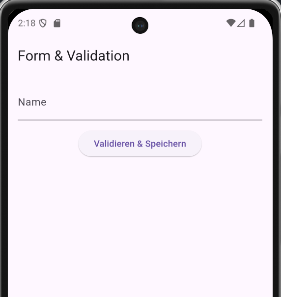{width=300px}

#### PDF & Drucken (pdf, printing)
In Flutter können PDF-Dokumente mithilfe externer Packages erstellt und verarbeitet werden. Das Package `pdf` ermöglicht die programmgesteuerte Erstellung von PDF-Dateien, die Text, Bilder und weitere Layout-Elemente enthalten können. Nach dem Einbinden der entsprechenden Dependency in der Datei `pubspec.yaml` kann die PDF-Erstellung direkt innerhalb der Anwendung erfolgen.

Das folgende Codebeispiel zeigt die Erstellung eines einfachen PDF-Dokuments mit einer zentrierten Textausgabe.

```dart
final pdf = pw.Document();

pdf.addPage(
  pw.Page(
    pageFormat: PdfPageFormat.a4,
    build: (pw.Context context) {
      return pw.Center(
        child: pw.Text('Hello World'),
      );
    },
  ),
);
```
[@pdf]

Für das Drucken oder Teilen von PDF-Dokumenten kommt das Package `printing` zum Einsatz. Dieses ermöglicht es, die plattformspezifische Druckumgebung von Android und iOS zu öffnen und erstellte PDF-Dokumente auszudrucken oder zu speichern. Das folgende Beispiel zeigt das Teilen eines PDF-Dokuments.

```dart
await Printing.sharePdf(
  bytes: await pdf.save(),
  filename: 'my-document.pdf',
);

```
[@printing]

#### Lokalisierung & Formatierung (flutter_localization, intl)
In Flutter wird die Lokalisierung einer Anwendung mithilfe des Packages `flutter_localization` umgesetzt. Unter Lokalisierung versteht man die Anpassung der Anwendung an verschiedene Sprachen, beispielsweise Deutsch oder Englisch. Dabei kann festgelegt werden, welche Sprachen von der Anwendung unterstützt werden. Die Auswahl der Sprache erfolgt üblicherweise automatisch anhand der Systemsprache des Endgeräts, kann jedoch auch explizit vorgegeben werden.

Das Package `flutter_localization` stellt jedoch keine automatische Übersetzung eigener Texte bereit, sondern übersetzt ausschließlich die standardisierten UI-Elemente von Flutter selbst. Für die Übersetzung eigener Inhalte sowie für weitergehende Formatierungsaufgaben wird das Package `intl` verwendet. Dieses ermöglicht unter anderem die Lokalisierung von Texten sowie die länderspezifische Formatierung von Datums-, Zeit- und Währungswerten.

Das folgende Codebeispiel zeigt die Formatierung eines Geldbetrags im österreichischen Zahlenformat. [@intl, @flutter_docs]

```dart
final eur = NumberFormat.currency(locale: 'de_AT', symbol: 'EUR');
print(eur.format(1234.56)); // 1.234,56 EUR
```

### App-Architektur
Eine durchdachte App-Architektur ist ein wesentlicher Faktor für die Wartbarkeit und Erweiterbarkeit einer Anwendung. Ziel ist es, die Benutzeroberfläche (UI) klar von der Anwendungslogik, den Services sowie dem Backend- und Datenzugriff zu trennen. Durch diese Trennung der Verantwortlichkeiten wird der Code übersichtlicher und besser wartbar.

Bereits vor Beginn der Implementierung sollte eine sinnvolle Projekt- und Ordnerstruktur definiert werden. Eine klare Architektur erleichtert die Weiterentwicklung der Anwendung und unterstützt eine logische Gliederung der einzelnen Komponenten.

#### Projekt-/Ordnerstruktur
Eine klare Projekt- und Ordnerstruktur trägt wesentlich zur Übersichtlichkeit und Wartbarkeit einer Anwendung bei. In Flutter-Projekten hat es sich bewährt, den Code in mehrere logisch getrennte Hauptordner zu gliedern. Häufig verwendete Verzeichnisse sind `config`, `core`, `models`, `screens` und `widgets`.

Im Ordner `config` werden zentrale Konfigurationsdateien abgelegt, beispielsweise Themes zur Definition von Farb- und Stileinstellungen für Light- und Dark-Mode. Der Ordner `core` enthält grundlegende Komponenten wie Services, Provider, Hilfsklassen (*Utils*) sowie globale Konstanten.  

Datenmodelle, beispielsweise zur Abbildung von Datenbanktabellen oder API-Strukturen, werden im Ordner `models` definiert. Die sichtbaren Seiten der Anwendung werden im Ordner `screens` abgelegt. Dieser kann weiter unterteilt werden, etwa in einen Bereich für Authentifizierung (z. B. Login und Registrierung) und einen Hauptbereich für die eigentlichen Anwendungsseiten.

Wiederverwendbare UI-Komponenten werden im Ordner `widgets` gesammelt. Dazu zählen beispielsweise benutzerdefinierte Eingabefelder oder andere häufig genutzte UI-Elemente, die in mehreren Screens eingesetzt werden.
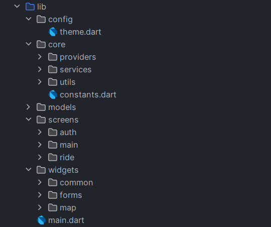{width=300px}

#### Schichtenmodell
Das Schichtenmodell beschreibt die klare Trennung der Anwendung in mehrere logische Ebenen, insbesondere in Benutzeroberfläche (UI), Service-Schicht und Backend beziehungsweise Datenzugriff. Diese Struktur wird durch die zuvor beschriebene Projekt- und Ordnerstruktur zusätzlich unterstützt.

Die Kommunikation zwischen den einzelnen Schichten erfolgt dabei in einer klar definierten Reihenfolge. Die Benutzeroberfläche interagiert ausschließlich mit der Service-Schicht, welche die Geschäftslogik kapselt und bei Bedarf Anfragen an das Backend oder den Datenzugriff weiterleitet, beispielsweise für Datenbankoperationen oder API-Aufrufe.

Durch diese Trennung der Verantwortlichkeiten wird die Wartbarkeit und Erweiterbarkeit der Anwendung deutlich verbessert. Zudem erleichtert das Schichtenmodell die Zusammenarbeit im Team, da einzelne Komponenten unabhängig voneinander entwickelt und angepasst werden können.

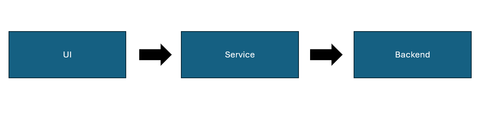{width=400px}

#### Wiederverwendbare Komponenten (Widgets)
Unter wiederverwendbaren Komponenten versteht man in Flutter selbst erstellte Widgets, die mehrfach innerhalb einer Anwendung eingesetzt werden können. In vielen Anwendungen sollen bestimmte UI-Elemente, wie beispielsweise Buttons oder Eingabefelder, ein einheitliches Design sowie identische Funktionalitäten aufweisen.

Durch die Kapselung dieser Elemente in eigene Widgets können sie zentral definiert und in verschiedenen Screens wiederverwendet werden. Dies reduziert Code-Duplikate, erhöht die Lesbarkeit des Quellcodes und erleichtert die Wartung sowie Erweiterung der Anwendung.

#### Fehlerbehandlung & Nutzerfeedback
Eine strukturierte Fehlerbehandlung ist ein wesentlicher Bestandteil einer stabilen Anwendung. Fehler können beispielsweise durch eine fehlende Internetverbindung oder nicht verfügbare Standortdaten entstehen. In solchen Fällen sollte die Anwendung nicht abstürzen, sondern kontrolliert auf die jeweilige Situation reagieren.

Durch den Einsatz von `try-catch`-Blöcken können auftretende Exceptions abgefangen und entsprechend behandelt werden. Zusätzlich ist es wichtig, dem Benutzer ein verständliches Feedback bereitzustellen, etwa in Form von Hinweisen oder Fehlermeldungen. Parallel dazu können Fehlersituationen protokolliert werden, um diese während der Entwicklung oder im Betrieb nachvollziehen und analysieren zu können.

#### Lokale Persistenz (shared_preferences)
Unter lokaler Persistenz versteht man die Speicherung von Daten direkt auf dem Endgerät des Benutzers. In Flutter kann hierfür das Package `shared_preferences` verwendet werden. Dieses ermöglicht das dauerhafte Ablegen einfacher Schlüssel-Wert-Paare, die auch nach dem Neustart der Anwendung verfügbar bleiben.

Typische Anwendungsfälle für lokale Persistenz sind das Speichern von Benutzereinstellungen, wie beispielsweise der gewählte Dark- oder Light-Mode, sowie das Merken des Anmeldestatus eines Benutzers. Durch die lokale Speicherung dieser Informationen wird die Benutzerfreundlichkeit der Anwendung erhöht, da wiederkehrende Eingaben vermieden und individuelle Einstellungen beibehalten werden können.


### State-Management
Unter State-Management versteht man die Verwaltung und Weitergabe von Zustandsdaten innerhalb einer Anwendung. Dazu zählen beispielsweise Benutzereingaben, aktuelle UI-Zustände oder geladene Daten, die von mehreren Widgets benötigt werden. Ziel des State-Managements ist es, diese Informationen konsistent zu speichern, zu aktualisieren und zwischen verschiedenen Komponenten der Benutzeroberfläche bereitzustellen.

Flutter bietet unterschiedliche Möglichkeiten zur Verwaltung von State. Einfache Zustände können direkt innerhalb von `StatefulWidget`s gehalten werden. Für komplexere Anwendungen kommen Mechanismen wie `ChangeNotifier` und `Listenable` zum Einsatz, die eine strukturierte Trennung von UI und Logik ermöglichen. Darüber hinaus kann State auch über Konstruktoren an untergeordnete Widgets weitergegeben werden. Die Auswahl der jeweiligen Methode hängt vom Umfang und der Komplexität der Anwendung ab. [@flutter_docs]

#### Begriff „State“
Der Begriff *State* bezeichnet in Flutter den aktuellen Zustand einer Anwendung. Dazu zählen alle Informationen und Objekte, die Einfluss auf die Darstellung der Benutzeroberfläche haben, wie beispielsweise Benutzereingaben, ausgewählte Elemente oder geladene Daten. Darüber hinaus umfasst der State auch Zustände, die zur Verwaltung von Ressourcen oder zur Steuerung des Anwendungsverhaltens erforderlich sind. [@flutter_docs]

#### Grundkonzept von Provider (ChangeNotifier)
Für ein strukturiertes State-Management in Flutter kann das Package `provider` eingesetzt werden. Zentrales Element dieses Ansatzes ist der `ChangeNotifier`, welcher den aktuellen Zustand einer Anwendung kapselt und Änderungen an diesem Zustand verwaltet.

Der State wird dabei in einem sogenannten Provider gespeichert. Sobald sich der Zustand ändert, informiert der `ChangeNotifier` automatisch alle abhängigen Widgets über diese Änderung, sodass die Benutzeroberfläche entsprechend aktualisiert wird. Dadurch wird eine klare Trennung zwischen UI und Zustandslogik erreicht.

Ein typisches Anwendungsbeispiel ist die Verwaltung des App-Themes. In einem Theme-Provider kann der aktuelle Modus, beispielsweise Light- oder Dark-Mode, gespeichert werden. Änderungen am Theme-Zustand werden über den Provider an die gesamte Anwendung weitergegeben, wodurch ein konsistentes Erscheinungsbild sichergestellt wird. [@provider]

#### Datenfluss und UI-Updates (notifyListeners)
Die Methode `notifyListeners()` stellt das zentrale Element für UI-Updates im Provider-basierten State-Management dar. Sie wird innerhalb eines `ChangeNotifier` aufgerufen, sobald sich der gespeicherte Zustand ändert.

Widgets können über Mechanismen wie `Provider.of(context)` oder `Consumer<T>` an einen Provider gebunden werden. Diese Widgets registrieren sich damit als Listener und werden automatisch benachrichtigt, sobald `notifyListeners()` aufgerufen wird. Infolge dieser Benachrichtigung wird die betroffene Benutzeroberfläche neu aufgebaut (*rebuild*), sodass der aktuelle Zustand korrekt dargestellt wird.

Durch dieses Vorgehen wird ein klarer und nachvollziehbarer Datenfluss zwischen Zustandsverwaltung und Benutzeroberfläche gewährleistet, ohne dass direkte Abhängigkeiten zwischen einzelnen Widgets entstehen. [@provider]

### Navigation & Routing in Flutter
Unter Navigation versteht man in Flutter den Wechsel zwischen verschiedenen Seiten (Screens) einer Anwendung. Dieser Seitenwechsel wird über den `Navigator` und das zugrunde liegende Routing-System realisiert. Dabei können neue Seiten geöffnet, bestehende geschlossen oder ganze Navigationsstapel verändert werden.

Typische Anwendungsfälle sind beispielsweise der Wechsel vom Login-Screen zur Startseite nach einer erfolgreichen Anmeldung oder das Öffnen von Detailansichten aus Listen. Flutter stellt hierfür unterschiedliche Navigationsansätze bereit, unter anderem imperatives Routing mit dem `Navigator` sowie deklaratives Routing mithilfe eines Routers. [@flutter_docs]

#### Navigator-Grundlagen
Der `Navigator` verwaltet in Flutter die Navigation zwischen einzelnen Seiten (Screens) einer Anwendung. Dabei arbeitet er mit sogenannten Routen. Eine Route bezeichnet dabei eine Seite beziehungsweise einen Screen, der über einen eindeutigen Namen identifiziert werden kann, zum Beispiel `/login` für eine Login-Seite.

Der Navigator organisiert die Routen in Form eines Stacks. Neue Seiten werden mit der Methode `push()` oben auf den Stack gelegt und anschließend angezeigt. Mit `pop()` wird die oberste Seite vom Stack entfernt, sodass die zuvor angezeigte Seite wieder sichtbar wird.

Ein typisches Beispiel ist der Wechsel zwischen Login- und Registrierungsseite: Wird von der Login-Seite aus die Registrierung geöffnet, wird diese per `push()` auf den Stack gelegt. Nach erfolgreicher Registrierung kann über `pop()` zur Login-Seite zurückgekehrt werden, ohne dass diese neu aufgebaut werden muss. [@flutter_docs]

#### Auth-Gate / Session-Handling
Ein Auth-Gate steuert den Zugriff auf bestimmte Bereiche einer Anwendung basierend auf dem Anmeldestatus eines Benutzers. Es überprüft, ob ein Benutzer aktuell angemeldet ist, und entscheidet daraufhin, welche Seiten der App angezeigt oder gesperrt werden. In der Praxis bedeutet dies beispielsweise, dass nicht angemeldete Benutzer nur den Login- oder Registrierungsbereich sehen, während angemeldete Benutzer auf den Hauptbereich der Anwendung zugreifen können.

Das Session-Handling beschäftigt sich mit der Verwaltung dieses Anmeldestatus. Dabei werden Sitzungsdaten gespeichert, überwacht und bei erneutem Start der Anwendung wiederhergestellt. Grundlage können unter anderem Sessions eines externen Authentifizierungssystems wie Supabase sein. Diese Sitzungsinformationen können zusätzlich lokal, etwa mithilfe von `shared_preferences`, persistiert werden, um Benutzer nach einem Neustart der App weiterhin angemeldet zu halten. [@supabase_sessions]

#### Navigation mit BottomNavigationBar
Eine benutzerfreundliche Möglichkeit zur Navigation zwischen den Hauptbereichen einer App ist die Verwendung einer `BottomNavigationBar`. Dabei befindet sich am unteren Rand des Bildschirms eine dauerhaft sichtbare Navigationsleiste mit mehreren Auswahlpunkten, beispielsweise „Startseite“, „Nachrichten“ oder „Profil“.

Durch die Auswahl eines Eintrags in der `BottomNavigationBar` kann zwischen den zugehörigen Seiten gewechselt werden, ohne dass der Benutzer die Orientierung in der App verliert. In Flutter wird die Umsetzung über die Klasse `BottomNavigationBar` beziehungsweise über die modernere `NavigationBar` realisiert. [@dart-docs]
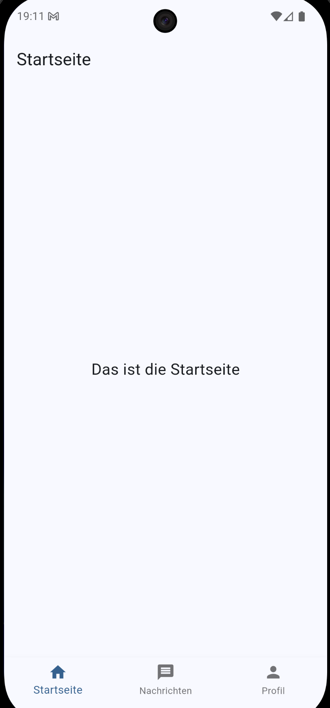{width=300px}

### Standort & Karten in Flutter
Zur Arbeit mit Standortdaten und Karten in Flutter werden in der Regel mehrere Packages kombiniert eingesetzt. Für den Zugriff auf den Gerätestandort ist zunächst die Einholung der entsprechenden Berechtigungen erforderlich, was beispielsweise mit dem Package `permission_handler` umgesetzt werden kann.

Die eigentliche Standortbestimmung erfolgt häufig mithilfe des Packages `geolocator`, das Funktionen zur Ermittlung der aktuellen Position sowie zu Entfernungs- und Richtungsberechnungen bereitstellt. Für die Darstellung von Karten können Bibliotheken wie `flutter_map` in Kombination mit Kartendiensten wie OpenStreetMap verwendet werden. Ergänzend kommen Packages wie `latlong2` zur Verarbeitung geografischer Koordinaten zum Einsatz.

#### Berechtigungen (permission_handler)
Für den Zugriff auf sensible Funktionen eines Endgeräts, wie Kamera oder Standort, ist in modernen Betriebssystemen eine ausdrückliche Benutzerberechtigung erforderlich. In Flutter kann die Verwaltung dieser Berechtigungen mithilfe des Packages `permission_handler` umgesetzt werden. Dieses ermöglicht das Abfragen des aktuellen Berechtigungsstatus sowie das Anfordern der benötigten Rechte direkt aus der Anwendung heraus.

Die Anfrage von Berechtigungen erfolgt asynchron. Der Benutzer kann verschiedene Entscheidungen treffen, beispielsweise das dauerhafte Erteilen, das einmalige Verweigern oder das permanente Ablehnen einer Berechtigung („Nie wieder fragen“). Das folgende Codebeispiel zeigt eine mögliche Implementierung zur Anforderung der Standortberechtigung. [@permission_handler]


```dart
Future<bool> ensureLocationPermission() async {
  // 1) Aktuellen Status abfragen
  var status = await Permission.location.status;

  if (status.isGranted) {
    // Standortberechtigung ist bereits erteilt
    return true;
  }

  if (status.isDenied) {
    // Noch nie gefragt oder abgelehnt (aber nicht permanent)
    // => jetzt anfragen
    status = await Permission.location.request();
  }

  if (status.isPermanentlyDenied) {
    // User hat "Nie wieder fragen" ausgewählt
    // => ggf. Dialog zeigen und zu den App-Einstellungen leiten
    await openAppSettings();
    return false;
  }

  if (status.isRestricted) {
    // iOS: z.B. durch Elternkontrolle eingeschränkt
    // Hier kannst du nur informieren, ändern kann das die App nicht
    return false;
  }

  if (status.isLimited) {
    // "ungefähre" Standortfreigabe
    // Für viele Apps okay, sonst entsprechend informieren
    return true; // oder false, je nach Anforderung
  }

  return status.isGranted;
}
```

#### Standortbestimmung (geolocator)
Zur Ermittlung des aktuellen Gerätestandorts kann in Flutter das Package `geolocator` verwendet werden. Neben der Bestimmung der aktuellen Position ermöglicht es auch die Berechnung von Distanzen zwischen zwei geografischen Koordinaten sowie weitere standortbezogene Abfragen.

Vor der Standortbestimmung muss überprüft werden, ob der Benutzer die erforderlichen Berechtigungen erteilt hat und ob die Standortdienste des Geräts aktiviert sind. Anschließend kann die aktuelle Position beispielsweise über die Methode `Geolocator.getCurrentPosition()` abgefragt werden. [@geolocator]

#### Kartenanzeige (flutter_map, latlong2)
Zur Darstellung von Karten in Flutter kann das Package `flutter_map` verwendet werden. Damit lässt sich über das `FlutterMap`-Widget eine interaktive Karte in die Anwendung einbinden, die typische Funktionen wie Zoomen und Verschieben unterstützt. Häufig werden dafür OpenStreetMap-Kartenkacheln verwendet. Zur Verbesserung der Benutzerfreundlichkeit können Karten sowohl im hellen als auch im dunklen Design eingebunden werden.
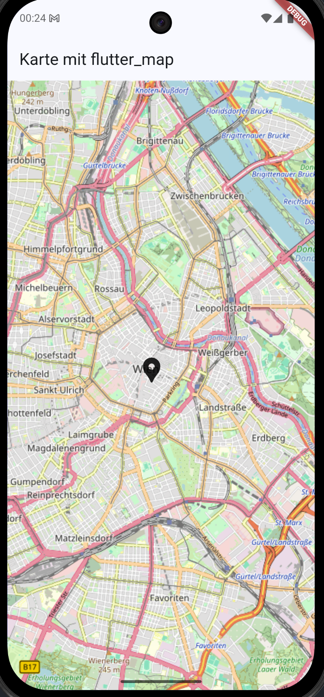{width=300px}

Für die Arbeit mit geografischen Koordinaten wird ergänzend das Package `latlong2` eingesetzt. Es stellt Datentypen für Längen- und Breitengrade bereit und ermöglicht unter anderem die Berechnung von Distanzen zwischen zwei Koordinatenpunkten. [@latlong2]
```dart
final int meters = distance(
  LatLng(52.518611, 13.408056),
  LatLng(51.519475, 7.46694444),
);

```

#### Live-Position & Marker (flutter_map_location_marker)
Neben statischen Markern, die direkt über das Package `flutter_map` gesetzt werden können, besteht häufig die Anforderung, die aktuelle Position des Benutzers in Echtzeit darzustellen. Für diesen Zweck kann das Package `flutter_map_location_marker` eingesetzt werden, das speziell zur Erweiterung von `flutter_map` entwickelt wurde.

Es ermöglicht die kontinuierliche Aktualisierung der Benutzerposition sowie die Darstellung eines dynamischen Positionsmarkers auf der Karte. Darüber hinaus können Marker hinsichtlich Form, Farbe und Symbolik individuell gestaltet werden, sodass sie an das Design der jeweiligen Anwendung angepasst werden können.
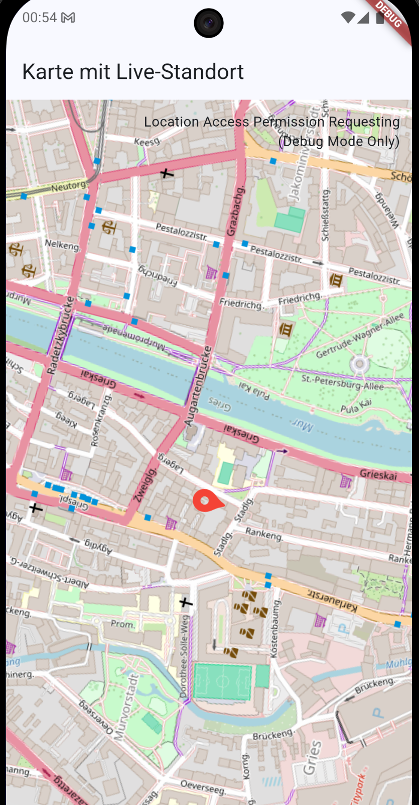{width=300px}

#### Suche & Geocoding (nominatim_flutter, flutter_typeahead)
Mithilfe des Packages `nominatim_flutter` können Geocoding-Funktionen in Flutter integriert werden. Unter Geocoding versteht man die Umwandlung zwischen Adressen und geografischen Koordinaten. Beim Reverse Geocoding werden Koordinaten in eine lesbare Adresse umgewandelt, beispielsweise von Breiten- und Längengrad zu einem Ortsnamen wie „Wien“. Umgekehrt können auch Adressen oder Postleitzahlen in Koordinaten übersetzt werden.

In Verbindung mit dem Package `flutter_typeahead` lassen sich Suchfelder mit automatischen Vorschlägen realisieren. Während der Eingabe werden bereits passende Ortsvorschläge angezeigt, etwa bei der Eingabe von „Leo“ der Vorschlag „Leoben“. Diese Kombination ermöglicht eine komfortable und benutzerfreundliche Ortssuche, wie sie auch in großen Kartendiensten eingesetzt wird. [@nominatim_flutter, @flutter_typeahead]
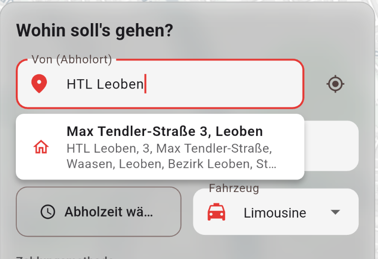{width=300px}

#### Routing / Route-Line (OSRM + http)
Wenn zwei geografische Punkte auf einer Karte gegeben sind, besteht häufig die Anforderung, eine dazugehörige Route – beispielsweise für die Autofahrt – zu berechnen. Hierfür kann der Routingdienst **OSRM (Open Source Routing Machine)** verwendet werden. OSRM stellt eine API bereit, über die Routen zwischen Koordinatenpunkten berechnet und als Geodaten zurückgegeben werden.

Für die Kommunikation mit dem Routingdienst kommt in Flutter in der Regel das `http`-Package zum Einsatz. Es ermöglicht das Senden von HTTP-Anfragen an die OSRM-API und das Auswerten der erhaltenen Antworten. Die vom Dienst zurückgelieferten Routendaten können anschließend verarbeitet und als Route-Linie in einer Kartenansicht dargestellt werden. [@http, @osrm_docs]
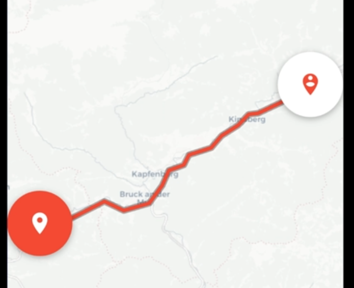{width=300px}


### Kartenbezahlung mit der SumUp API in Flutter

Die SumUp API ist eine von SumUp bereitgestellte Schnittstelle (Application Programming Interface), die es ermöglicht, Kartenzahlungen in selbst entwickelten Anwendungen zu integrieren. Über die API können unter anderem Zahlungen mit gängigen Debit- und Kreditkarten, wie beispielsweise Visa oder Mastercard, durchgeführt werden.

Durch die Verwendung der SumUp API kann eine eigene mobile Applikation um eine Kartenbezahlfunktion erweitert werden, ohne selbst ein vollständiges Zahlungssystem implementieren zu müssen. SumUp stellt dabei die notwendige Zahlungsabwicklung sowie die Einhaltung aktueller Sicherheitsstandards im Bereich des bargeldlosen Bezahlens sicher. [@sumup]

#### Sandbox-Umgebung statt Echtzahlungen

Für Entwicklungs- und Testzwecke stellt SumUp eine Sandbox-Umgebung zur Verfügung. In dieser Umgebung können Zahlungen simuliert werden, ohne dass echte Transaktionen durchgeführt werden. Dies ist insbesondere während der Entwicklung wichtig, um Funktionen wie Verbindungsaufbau zur REST-API und Zahlungsabläufe gefahrlos testen zu können.

Ein Sandbox-Konto kann über das SumUp Developer Portal angelegt werden. Es ist vom regulären Händlerkonto getrennt, sodass Testbuchungen keine realen finanziellen Auswirkungen haben. [@sumupApi]

#### Zahlungsabwicklung über die REST-API mit dem http-Package

Die Kommunikation mit der SumUp-Plattform erfolgt über eine REST-API. Zahlungen beziehungsweise Checkouts werden dabei über HTTP-Anfragen erstellt. Ein Checkout kann beispielsweise mittels einer `POST`-Anfrage angelegt werden:

```bash
curl https://api.sumup.com/v0.1/checkouts \
 -X POST \
 -H "Authorization: Bearer $SUMUP_API_KEY" \
 --json '{
    "checkout_reference": "",
    "amount": 0,
    "currency": "EUR",
    "merchant_code": "MERCHANTCODE"
  }'
```
In Flutter kann dieselbe Anfrage mithilfe des `http`-Packages umgesetzt werden. Dabei wird zunächst ein Checkout erstellt, die eigentliche Kartenzahlung erfolgt anschließend über den von SumUp bereitgestellten Zahlungsfluss. Ein Beispiel für eine Anfrage in Flutter ist:
```dart
final response = await http.post(
  Uri.parse('$_baseUrl/v0.1/checkouts'),
  headers: {
    'Content-Type': 'application/json',
    'Authorization': 'Bearer $_privateKey',
  },
  body: jsonEncode(requestBody),
).timeout(
  const Duration(seconds: 15),
  onTimeout: () {
    throw Exception('SumUp API timeout');
  },
);
```
Über diese Schnittstelle lassen sich unter anderem Beträge, Währung und Referenzkennungen definieren. Die Verarbeitung der Antwort erfolgt anschließend über das zurückgegebene JSON-Objekt. [@sumupApi]


### Lokale Benachrichtigungen

Lokale Benachrichtigungen sind Benachrichtigungen, die direkt auf dem Endgerät erzeugt und angezeigt werden, ohne dass dafür ein externer Server benötigt wird. Im Gegensatz zu Push-Benachrichtigungen aus der Cloud werden sie von der App selbst geplant und ausgelöst.

Sie können beispielsweise erscheinen, wenn die App im Vordergrund, Hintergrund oder – je nach Betriebssystem und Berechtigungen – geschlossen ist. Typische Anwendungsfälle sind Erinnerungen, Statusmeldungen oder Hinweise auf abgeschlossene Prozesse. [@geeksforgeekslocalnotification]

#### Grundkonzept von flutter_local_notifications

Zur Umsetzung lokaler Benachrichtigungen in Flutter wird häufig das Package `flutter_local_notifications` verwendet. Nach der Einbindung des Packages muss dieses einmalig initialisiert werden; anschließend übernimmt das Package die plattformspezifische Anzeige der Benachrichtigungen auf dem Endgerät.

In einer eigenen Service-Klasse (z. B. `LocalNotificationService`) kann eine statische Instanz des Plugins angelegt und über die Methode `initialize()` konfiguriert werden. Das folgende Beispiel zeigt eine einfache Implementierung für Android:

```dart
class LocalNotificationService {
  static final _plugin = FlutterLocalNotificationsPlugin();

  static Future<void> init() async {
    const initSettings = InitializationSettings(
      android: AndroidInitializationSettings('@mipmap/ic_launcher'),
    );
    await _plugin.initialize(initSettings);
  }

  static Future<void> showSimple(String title, String body) async {
    const androidDetails = AndroidNotificationDetails(
      'default_channel',
      'Standard',
      importance: Importance.max,
      priority: Priority.high,
    );

    await _plugin.show(
      0, // ID
      title,
      body,
      const NotificationDetails(android: androidDetails),
    );
  }
}
```
```dart
// z.B. im initState
LocalNotificationService.init();

// irgendwo in der App
LocalNotificationService.showSimple('Hi', 'Test-Notification');
```
Die Benachrichtigungen können anschließend an beliebiger Stelle in der Anwendung ausgelöst werden, beispielsweise nach bestimmten Nutzeraktionen oder Systemereignissen. [@geeksforgeekslocalnotification]

![Notification einer Flutter App [@localNotifications]](img/Winter/localNotification.png){width=300px}

#### Berechtigungen und Plattformunterschiede (Android/iOS)

Für die Darstellung lokaler Benachrichtigungen sind unter Android und iOS unterschiedliche Berechtigungen erforderlich. 

Unter Android müssen Benachrichtigungen explizit vom Benutzer erlaubt werden (seit Android 13 über die Berechtigung `POST_NOTIFICATIONS`). Ohne erteilte Berechtigung dürfen Benachrichtigungen nicht angezeigt werden.

Unter iOS wird der Benutzer beim ersten Initialisieren des Notification-Plugins um Zustimmung gebeten. Dabei kann er einzeln festlegen, ob Benachrichtigungen als Hinweis (Alert), mit Ton oder als Badge am App-Symbol erscheinen dürfen. Ohne diese Zustimmung werden keine Benachrichtigungen dargestellt. [@localNotifications]


#### Arten von Benachrichtigungen

Bei lokalen Benachrichtigungen kann grundsätzlich zwischen verschiedenen Auslösemechanismen unterschieden werden.

Zum einen gibt es geplante (zeitgesteuerte) Benachrichtigungen. Dabei wird ein genauer Zeitpunkt definiert, zu dem die Benachrichtigung angezeigt werden soll. Ebenso können wiederkehrende Benachrichtigungen eingerichtet werden, die beispielsweise täglich um 8:00 Uhr oder in regelmäßigen Intervallen ausgelöst werden.

Zum anderen können Benachrichtigungen ereignisgesteuert ausgelöst werden. In diesem Fall erfolgt die Anzeige beispielsweise aufgrund einer Benutzeraktion oder einer Änderung von Daten in der Anwendung. Ob solche Ereignisse auch im Hintergrund verarbeitet werden können, hängt vom Betriebssystem und den vorhandenen Hintergrundberechtigungen ab. In vielen Fällen ist für ereignisbasierte Benachrichtigungen ohne laufende App eine serverseitige Push-Lösung erforderlich. [@localNotifications]


### Supabase
Supabase ist eine Plattform für Backend-as-a-Service (BaaS) und stellt Entwicklern eine Vielzahl an Diensten wie Authentifizierung, Datenbank, Storage und Realtime-Funktionen zur Verfügung. Die Plattform orientiert sich funktional an Firebase, setzt jedoch im Gegensatz dazu auf eine relationale PostgreSQL-Datenbank.

Supabase verfolgt einen Low-Code-Ansatz, wodurch viele Backend-Funktionen ohne umfangreiche Programmierkenntnisse genutzt werden können. Neben einem kostenlosen Tarif für kleinere Anwendungen stehen auch kostenpflichtige Pläne für größere Projekte mit erhöhtem Ressourcenbedarf zur Verfügung. [@supabase_tutorial]


#### Supabase Überblick (Auth, Database, Realtime)
Supabase stellt mehrere zentrale Dienste bereit, die in modernen Anwendungen häufig benötigt werden. Dazu zählen insbesondere die Komponenten Auth, Database und Realtime.

Der Dienst **Auth** dient zur Verwaltung von Benutzerkonten und unterstützt Funktionen wie Registrierung, Anmeldung, Passwortzurücksetzung und E-Mail-Bestätigung. Die Passwörter der Benutzer werden dabei nicht im Klartext gespeichert, sondern sicher gehasht. Auth lässt sich direkt in Flutter-Anwendungen integrieren und beispielsweise mit einem Login-System verbinden.

Die Komponente **Database** stellt eine relationale PostgreSQL-Datenbank zur Verfügung. In dieser können Tabellen angelegt, Datensätze erstellt und Abfragen durchgeführt werden. Zusätzlich unterstützt Supabase Datenbankfunktionen, Trigger und Policies zur Zugriffskontrolle.

Mit **Realtime** können Änderungen an Datenbankeinträgen in Echtzeit erkannt und an angebundene Clients weitergegeben werden. Dadurch ist es möglich, Benutzeroberflächen automatisch zu aktualisieren, sobald sich Daten verändern, ohne dass eine manuelle Aktualisierung erforderlich ist. [@supabase_docs]


#### Authentifizierung (supabase_flutter)
Die Authentifizierung in Supabase basiert auf dem Auth-Dienst und lässt sich über das Package `supabase_flutter` direkt in Flutter-Anwendungen integrieren. Nach der Initialisierung des Supabase-Clients können Benutzerkonten angelegt, Anmeldungen durchgeführt und Sitzungen verwaltet werden.

Das folgende Beispiel zeigt die Initialisierung von Supabase in einer Flutter-App sowie die Registrierung eines Benutzers mittels E-Mail und Passwort.

```dart
void main() async {
  WidgetsFlutterBinding.ensureInitialized();

  await Supabase.initialize(
    url: SUPABASE_URL,
    anonKey: SUPABASE_ANON_KEY,
  );

  runApp(MyApp());
}

final supabase = Supabase.instance.client;

// Registrierung mit E-Mail und Passwort
await supabase.auth.signUp(
  email: email,
  password: password,
);
```
[@supabase_flutter]

#### Datenzugriff (CRUD)
Der Zugriff auf Daten in Supabase erfolgt in Flutter über den Supabase-Client. Typische Operationen sind das Erstellen, Lesen, Aktualisieren und Löschen von Datensätzen und werden unter dem Begriff **CRUD** (Create, Read, Update, Delete) zusammengefasst. Abfragen können gefiltert werden und ermöglichen so den gezielten Zugriff auf bestimmte Datensätze, beispielsweise in Abhängigkeit vom aktuell angemeldeten Benutzer.

Das folgende Beispiel zeigt das Auslesen und Einfügen von Datensätzen in einer Tabelle mittels Supabase-Client. Auf erweiterte sicherheitsrelevante Aspekte, wie Row Level Security (RLS), wird in einem späteren Kapitel noch näher eingegangen.

```dart
// Datensätze lesen (SELECT) mit Filtern
final data = await supabase
    .from('cities')
    .select()
    .eq('country_id', 1)   // equals-Filter
    .neq('name', 'The Shire'); // not-equals-Filter

// Neuen Datensatz einfügen (INSERT)
await supabase
    .from('cities')
    .insert({'name': 'The Shire', 'country_id': 554});
```
[@supabase_flutter]

#### Realtime / Subscriptions
Die Realtime-Funktion von Supabase ermöglicht es, Datenbankänderungen in Echtzeit zu verarbeiten. Änderungen an Datensätzen werden unmittelbar an verbundene Clients übermittelt, sodass Benutzeroberflächen ohne manuelle Aktualisierung auf dem aktuellen Stand gehalten werden. Dies ist insbesondere in Anwendungen relevant, in denen Informationen ohne Verzögerung aktualisiert werden müssen, beispielsweise in Chat-, Shop- oder Tracking-Systemen.

Damit Realtime genutzt werden kann, muss die Funktion für die betreffende Tabelle in Supabase aktiviert werden. In Flutter können anschließend sogenannte Subscriptions eingerichtet werden. Dabei „abonniert“ der Client eine Tabelle oder einzelne Ereignisarten (Insert, Update, Delete) und erhält bei Änderungen entsprechende Benachrichtigungen. [@supabase_flutter]

```dart
// Subscription auf eine Supabase-Tabelle
final channel = supabase.channel('public:orders')
  ..onPostgresChanges(
    event: PostgresChangeEvent.all,
    schema: 'public',
    table: 'orders',
    callback: (payload) {
      debugPrint('Event: ${payload.eventType}, data: ${payload.newRecord}');
    },
  )
  ..subscribe();

// Verarbeitung der Änderungen
void handleOrderChange(PostgresChangePayload payload) {
  // neue Daten nach Insert/Update
  final newData = payload.newRecord;

  // alte Daten bei Delete/Update
  final oldData = payload.oldRecord;

  debugPrint('Event: ${payload.eventType}, data: $newData');

  // hier könnte z. B. die UI aktualisiert werden
  // (setState, Provider-Update usw.)
}
```
[@supabase_flutter]

#### Datenmodelle & Mapping (JSON <-> Dart)
Die Kommunikation zwischen Supabase und der Flutter-Anwendung erfolgt im JSON-Format. Die von Supabase empfangenen JSON-Objekte werden in Flutter in der Regel zunächst als `Map<String, dynamic>` verarbeitet und anschließend in passende Dart-Datenmodelle überführt.

Für komplexere Strukturen, wie beispielsweise Benutzersitzungen oder eigene Datenobjekte, wird häufig ein klassisches Mapping über `fromJson`- und `toJson`-Methoden verwendet. Dadurch können JSON-Daten in typsichere Dart-Objekte konvertiert und umgekehrt wieder in JSON übertragen werden.

Diese Datenmodelle lassen sich anschließend in der Benutzeroberfläche weiterverwenden, beispielsweise in Verbindung mit `StreamBuilder` oder State-Management-Lösungen, um Änderungen direkt in der UI darzustellen. [@supabase_flutter]


### Authentifizierung & Sicherheit (RLS/Policies)
Ein wichtiger Aspekt einer Anwendung ist der sichere Umgang mit Benutzeranmeldungen und Zugriffsrechten. Nach einer erfolgreichen Authentifizierung stellt Supabase eine Sitzung (Session) bereit, die unter anderem ein Zugriffstoken enthält. Dieses Token wird bei weiteren Anfragen an das Backend verwendet, um den Benutzer eindeutig zu identifizieren und dessen Berechtigungen zu überprüfen.

Neben der Authentifizierung spielt auch die Zugriffskontrolle auf Daten eine zentrale Rolle. Supabase unterstützt hierfür Row Level Security (RLS). Mithilfe von Policies kann präzise festgelegt werden, welche Datensätze ein angemeldeter Benutzer lesen, einfügen, ändern oder löschen darf. Dadurch ist es möglich, Zugriffsrechte direkt auf Datenbankebene abzusichern und zu verhindern, dass Benutzer auf fremde Daten zugreifen. [@supabase_docs]

#### Session & Token-Grundidee
Nach einer erfolgreichen Anmeldung eines Benutzers erstellt Supabase eine Sitzung (Session), die ein Authentifizierungstoken enthält. Dieses Token wird bei weiteren Anfragen der App an das Backend mitgesendet und dient dazu, den Benutzer eindeutig zu identifizieren.

Anhand des Tokens wird serverseitig überprüft, ob der Benutzer angemeldet ist und welche Berechtigungen ihm zustehen. Sobald eine Sitzung abläuft oder der Benutzer sich abmeldet, verliert das Token seine Gültigkeit und der Zugriff auf geschützte Bereiche ist nicht mehr möglich. [@supabase_docs]

#### Row Level Security (RLS)
Row Level Security (RLS) ist ein Sicherheitsmechanismus von PostgreSQL, der den Zugriff auf Daten auf Zeilenebene steuert. Dadurch kann definiert werden, welche Datensätze ein Benutzer lesen oder verändern darf. Der Zugriff erfolgt somit nicht nur auf Tabellen- oder Spaltenebene, sondern auf einzelne Zeilen.

In Supabase ist RLS für neu erstellte Tabellen standardmäßig aktiviert, sofern diese nicht über die grafische Oberfläche angelegt wurden. Wird eine Tabelle per SQL-Anweisung erstellt, muss RLS gegebenenfalls manuell aktiviert werden. Mithilfe von RLS lassen sich sehr fein abgestufte Sicherheitsregeln definieren, die exakt an die Anforderungen einer Anwendung angepasst werden können. [@supabase_docs]


#### Policies (SELECT/INSERT/UPDATE/DELETE)
Policies werden in Kombination mit Row Level Security (RLS) verwendet und legen fest, auf welche Datensätze einer Tabelle ein Benutzer zugreifen darf. Eine Policy ist immer einer konkreten Tabelle zugeordnet und wird bei jedem Lese- oder Schreibzugriff ausgewertet. Sie wirkt funktional ähnlich wie eine zusätzliche `WHERE`-Bedingung, die automatisch an jede Anfrage an die Tabelle angehängt wird. 

Policies können für alle grundlegenden Datenbankoperationen definiert werden, also für **SELECT** (Lesen), **INSERT** (Einfügen), **UPDATE** (Ändern) und **DELETE** (Löschen).

Policies können entweder direkt in SQL formuliert oder über die grafische Oberfläche von Supabase konfiguriert werden. Im folgenden Beispiel wird eine Policy definiert, die bewirkt, dass Benutzer nur ihre eigenen Datensätze lesen dürfen:


```sql
create policy "Individuals can view their own todos."
on todos
for select
using ( (select auth.uid()) = user_id );
```

Dabei wird geprüft, ob die Benutzer-ID der aktuellen Sitzung (`auth.uid()`) mit der `user_id` der jeweiligen Tabellenzeile übereinstimmt. Nur wenn diese Bedingung erfüllt ist, wird der Datensatz zurückgegeben. Ohne eine entsprechende Policy würde RLS standardmäßig sämtliche Zugriffe blockieren. [@supabase_docs]

#### Datenschutz
Die zuvor beschriebenen Mechanismen wie Authentifizierung, Row Level Security (RLS) und Policies sind zentral für den Schutz personenbezogener Daten. In vielen Anwendungen werden sensible Informationen verarbeitet, beispielsweise Namen, E-Mail-Adressen oder Standortdaten.

Durch die Kombination dieser Sicherheitsmechanismen wird sichergestellt, dass Benutzer nur auf diejenigen Daten zugreifen können, für die sie berechtigt sind. Unbefugtes Auslesen oder Verändern fremder Datensätze wird dadurch unterbunden, was einen wesentlichen Beitrag zur Einhaltung von Datenschutzanforderungen leistet.

\newpage

## Praktische Arbeit

### Technologiestack & Auswahl

Für die Umsetzung des Projekts, in dem mehrere Anwendungen zusammenarbeiten und miteinander kommunizieren müssen, wurde Supabase als Backend-Plattform gewählt. Wie bereits im Theorieteil beschrieben, bietet Supabase eine Vielzahl an Funktionen, die diese Anforderungen optimal unterstützen, darunter Authentifizierung, Realtime-Funktionalität sowie die Definition von Sicherheitsrichtlinien mittels Policies und Row Level Security (RLS). Dadurch kann ein leistungsfähiges Backend mit vergleichsweise geringem Implementierungsaufwand realisiert werden. Supabase wurde zudem gewählt, weil der fachliche Schwerpunkt des Projekts stärker auf der Entwicklung der mobilen Anwendungen als auf der Implementierung eines komplexen Backends liegen sollte.

Für die Entwicklung der Kunden-App kam das Framework Flutter zum Einsatz. Flutter ermöglicht die plattformübergreifende Entwicklung für Android und iOS auf Basis einer gemeinsamen Codebasis, ohne betriebssystemspezifischen Code schreiben zu müssen. Darüber hinaus lagen bereits Vorkenntnisse aus dem Unterricht vor, wodurch eine effiziente Umsetzung der Anwendung möglich war. Die Anbindung an Supabase wird durch das Package `supabase_flutter` zusätzlich deutlich vereinfacht.

Neben `supabase_flutter` wurden weitere Flutter-Packages eingesetzt, beispielsweise `flutter_map` zur Kartendarstellung innerhalb der Anwendung. Eine große Unterstützung im Entwicklungsprozess stellt zudem die Funktion *Hot Reload* dar. Sie ermöglicht es, eine bereits laufende App auf einem Emulator oder einem realen Endgerät innerhalb weniger Sekunden mit geänderter Benutzeroberfläche oder Logik neu zu laden, ohne die Anwendung vollständig neu starten und kompilieren zu müssen. Dies ist jedoch nur möglich, sofern keine Änderungen an der Datei `pubspec.yaml` vorgenommen wurden.

Zum Entwickeln der Anwendung wurde die IDE Android Studio verwendet. Dieses Tool kam bereits im Unterricht zum Einsatz, wodurch bestehende Erfahrung genutzt werden konnte. Ein weiterer Vorteil von Android Studio besteht in der integrierten Möglichkeit, Emulatoren direkt aus der Entwicklungsumgebung heraus zu starten und damit die App komfortabel zu testen.

### Projektsetup & Architektur 

Für die Umsetzung der Kunden-App wurde in Android Studio ein neues Flutter-Projekt mit dem Namen `kunden_app` erstellt. Beim Anlegen eines Flutter-Projekts wird automatisch die grundlegende Projekt- und Ordnerstruktur erzeugt, bestehend unter anderem aus dem Ordner `lib` sowie der Datei `pubspec.yaml`. Zusätzlich wird von der IDE eine einfache Demo-Anwendung mit einer `main.dart`-Datei generiert.

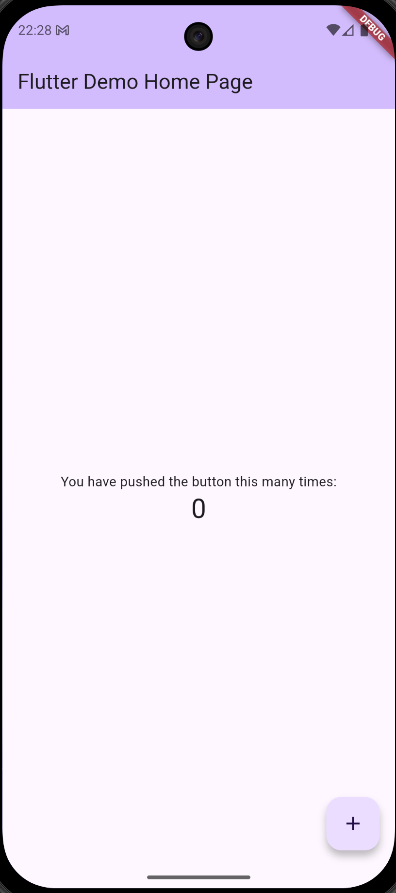{width=300px}

Anschließend wurde die Projektstruktur – wie im Theorieteil beschrieben – angepasst. Es wurden folgende Hauptordner angelegt:

- `config` – Konfigurationsdateien, z. B. `theme.dart`
- `core`
  - `providers` – State-Management
  - `services` – Geschäftslogik und Kommunikation mit dem Backend
  - `utils` – Hilfsklassen (z. B. `date_formatter`)
  - `constants.dart` – zentrale Konstanten, z. B. Fahrpreis je Kilometer
- `models` – Datenmodelle, unter anderem für Tabellen aus Supabase
- `screens` – alle UI-Seiten wie Login-, Haupt- oder Einstellungsbildschirm
- `widgets` – wiederverwendbare, selbst definierte Widgets

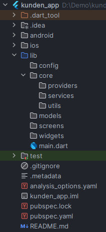{width=300px}

Anschließend wurden die benötigten Packages als Dependencies in der Datei `pubspec.yaml` eingetragen:
```yaml
dependencies:
  flutter:
    sdk: flutter
  supabase_flutter: ^2.0.0 #
  flutter_map: ^8.2.1 #
  latlong2: ^0.9.1 #
  permission_handler: ^12.0.1 #
  geolocator: ^14.0.2 #
  flutter_map_location_marker: ^10.1.0 #
  nominatim_flutter: ^0.0.8 #
  flutter_typeahead: ^5.2.0 #
  http: ^1.2.2 #
  printing: ^5.13.4 #
  pdf: ^3.11.0 #
  intl: ^0.20.2 #
  flutter_localization: ^0.3.3 #
  provider: ^6.1.1 #
  shared_preferences: ^2.2.2 #
  flutter_local_notifications: ^19.5.0 #
  cupertino_icons: ^1.0.8
```
Die wichtigsten Packages werden für folgende Aufgaben verwendet:

- `supabase_flutter`: Verbindung zum Supabase-Backend, z. B. Abrufen gespeicherter Fahrten
- `flutter_map`: grafische Kartendarstellung
- `latlong2`: Geokoordinatentypen und Distanzberechnungen
- `permission_handler`: Abfrage von Standort- und Benachrichtigungsberechtigungen
- `geolocator`: Zugriff auf GPS und Bestimmung der aktuellen Position
- `flutter_map_location_marker`: Live-Positionsmarker auf der Karte
- `nominatim_flutter`: Geocoding und Reverse-Geocoding mit OpenStreetMap
- `flutter_typeahead`: Eingabefelder mit Vorschlagsliste (Autocomplete)
- `http`: REST-Aufrufe, z. B. OSRM-Routing oder SumUp-API
- `printing`: Drucken oder Speichern erzeugter PDF-Dokumente
- `pdf`: Erzeugung von Rechnungen im PDF-Format
- `intl`: Formatierung von Datum, Zeit und Währungen
- `flutter_localizations`: Aktivierung der Flutter-Standardübersetzungen
- `provider`: State-Management, z. B. für Theme-Wechsel
- `shared_preferences`: lokale Speicherung von Einstellungen und Login-Informationen
- `flutter_local_notifications`: lokale Benachrichtigungen (Fahrt zugewiesen/gestartet/beendet)
- `cupertino_icons`: Icon-Satz im iOS-Stil

Nach dem Eintragen der Abhängigkeiten wurde mittels `pub get` die Installation durchgeführt.

Die Architektur der App gliedert sich in mehrere Schichten: Benutzeroberfläche (Screens und Widgets), Serviceschicht (`core/services`), Datenmodelle (`models`) sowie Konfigurations- und Konstantendateien (`config`, `core/constants`). Dabei übernehmen:

- die **UI-Schicht** die Darstellung und Interaktion mit der Benutzeroberfläche,
- die **Serviceschicht** die Geschäftslogik sowie die Kommunikation mit dem Backend,
- die **Daten- und Config-Schicht** das Mapping der Supabase-Daten in Models sowie zentrale Vorgaben wie Themes, Keys und Konstanten.

Durch die klare Trennung der Schichten wird die Wartbarkeit, Testbarkeit und Erweiterbarkeit deutlich verbessert.

Der Service Layer ist ein zentrales Element der Anwendung, da durch die Vielzahl eingesetzter Packages eine saubere Trennung der Logik notwendig ist. In diesem Projekt wurden folgende Service-Klassen implementiert:

- `location_service.dart`  
  Kapselt Standortlogik (Berechtigungen prüfen mit `permission_handler`, aktuelle Position über `geolocator` ermitteln) und stellt koordinatenbasierte Hilfsfunktionen bereit.

- `notification_service.dart`  
  Initialisiert `flutter_local_notifications` und ermöglicht das Planen und Anzeigen lokaler Benachrichtigungen, z. B. bei Fahrtzuweisungen oder bei Fahrtbeginn/-ende.

- `routing_service.dart`  
  Kommuniziert per `http` mit dem Routing-Backend (OSRM), berechnet Routen und Entfernungen und liefert Daten für die Kartenanzeige.

- `sumup_service.dart`  
  Bindet die SumUp-REST-API an, erstellt Checkouts und verwaltet den Zahlungsfluss (Sandbox), inklusive Fehler- und Timeout-Handling.

- `supabase_service.dart`  
  Enthält den Supabase-Client, übernimmt Authentifizierung, CRUD-Operationen auf Tabellen sowie gegebenenfalls Realtime-Subscriptions.

- `app_navigator.dart`  
  Stellt einen globalen `NavigatorKey` bereit, sodass auch Services ohne BuildContext zu benannten Routen navigieren können (z. B. nach Benachrichtigungen).


### Datenhaltung mit Supabase

Das Zusammenspiel zwischen Supabase und der Kunden-App beginnt bei der Registrierung in der Anwendung. Sobald sich ein neuer Benutzer registriert, werden die Daten an Supabase übermittelt und es wird ein Eintrag in der `auth`-Struktur angelegt. In der App wird anschließend darauf hingewiesen, dass die E-Mail-Adresse noch bestätigt werden muss. Erst nach erfolgreicher Bestätigung wird ein vollständiges Benutzerprofil angelegt, das in der Tabelle `profiles` gespeichert wird. 

Die Anmeldung (Login) erfolgt ebenfalls über den Auth-Dienst von Supabase mittels E-Mail-Adresse und Passwort. Bei fehlerhaften Zugangsdaten, etwa einem falschen Passwort, schlägt der Login-Vorgang fehl und Supabase liefert eine entsprechende Fehlermeldung zurück.

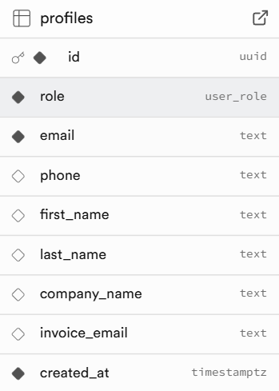{width=300px}
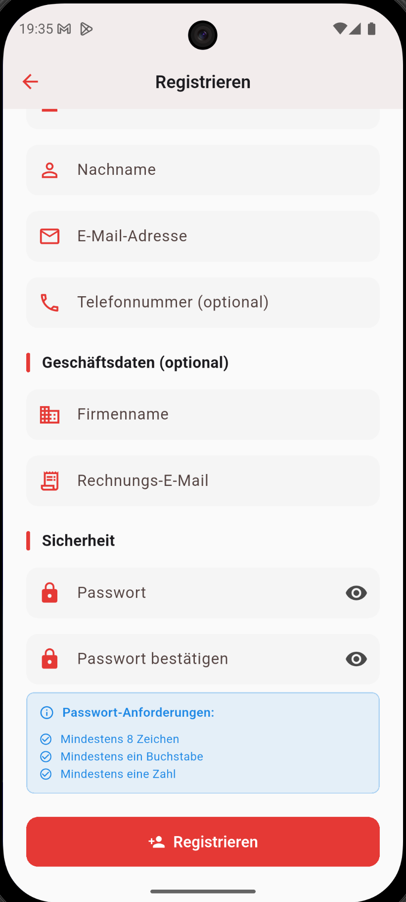{width=300px}
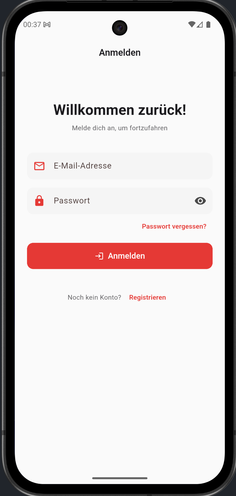{width=300px}

Neben der Tabelle `profiles` und der Authentifizierung sind für die Kunden-App insbesondere die Tabellen `rides`, `driver_locations` und `payments` relevant:

- `rides`: enthält die vom Benutzer erstellten Fahrten und erlaubt das Anzeigen und Verfolgen der eigenen Fahrten.
- `driver_locations`: speichert die aktuellen Positionen der Fahrer und wird für die Echtzeitverfolgung verwendet (Anfahrt des Fahrers, Restdauer bis zum Ziel).
- `payments`: dokumentiert Zahlungen, sowohl Kartenzahlungen über SumUp als auch Barzahlungen.

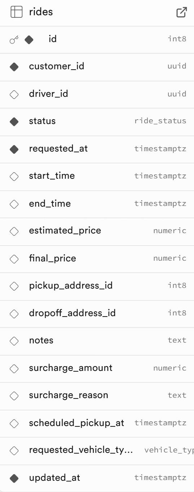{width=300px}
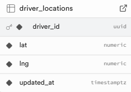{width=300px}
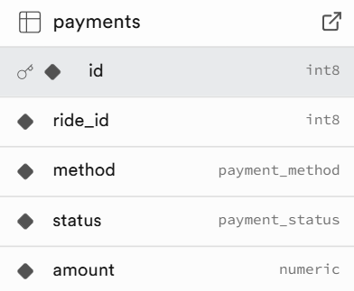{width=300px}

Um Zugriffsfehler durch Row Level Security (RLS) zu vermeiden, mussten für diese Tabellen mehrere Policies definiert werden. Die wichtigsten davon sind:

- **Policies für `payments`**  
  Wenn in der App eine Fahrt erstellt wird, wird im Vorfeld bereits ein Eintrag in der Tabelle `payments` angelegt. Der Benutzer benötigt daher das Recht, eigene Payment-Einträge anzulegen (`INSERT`), zu lesen (`SELECT`) und zu aktualisieren (`UPDATE`). Die folgende Policy erlaubt beispielsweise das Einfügen von Payment-Datensätzen für eigene Fahrten:

  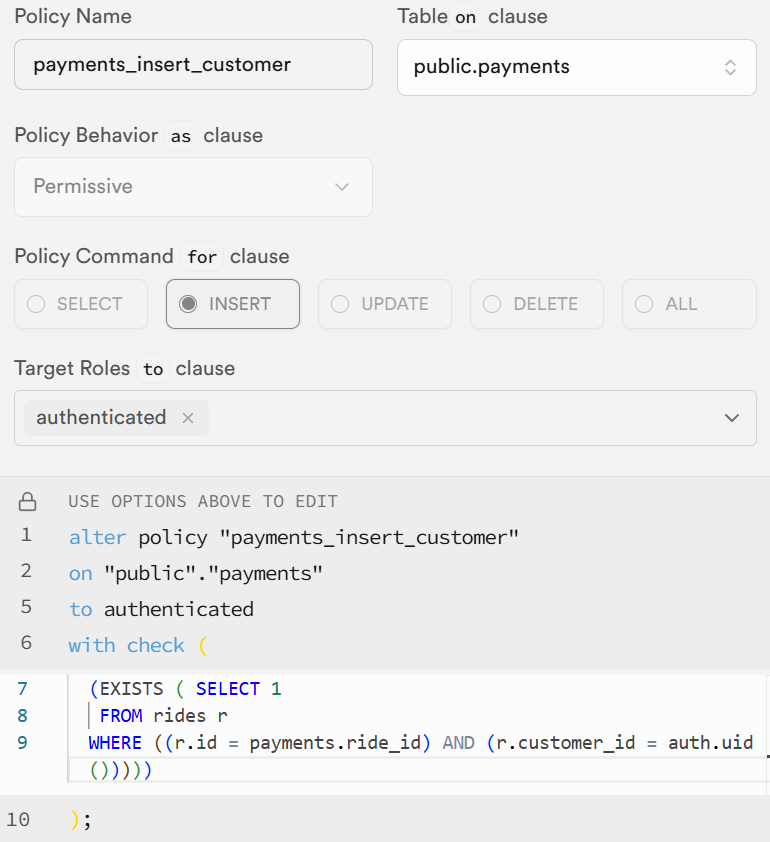{width=300px}

- **Policies für `rides`**  
  Analog dazu muss der Benutzer Fahrten in der Tabelle `rides` anlegen können, sowie ausschließlich seine eigenen Fahrten lesen und aktualisieren dürfen. Auch hier gibt es entsprechende Policies für `INSERT`, `SELECT` und `UPDATE`:

  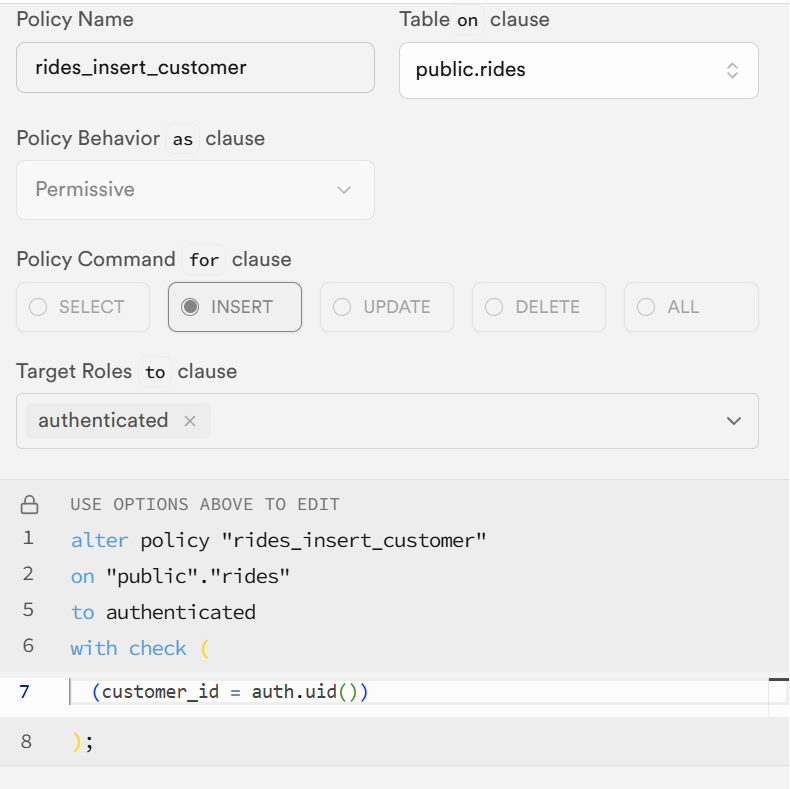{width=300px}

- **Policies für `driver_locations`**  
  Für die Echtzeitverfolgung darf ein Benutzer nur Standortdaten des Fahrers sehen, der der aktuellen Fahrt zugeordnet ist. Eine Policy auf `driver_locations` stellt sicher, dass nur Datensätze des zugeordneten Fahrers abgerufen werden können:

  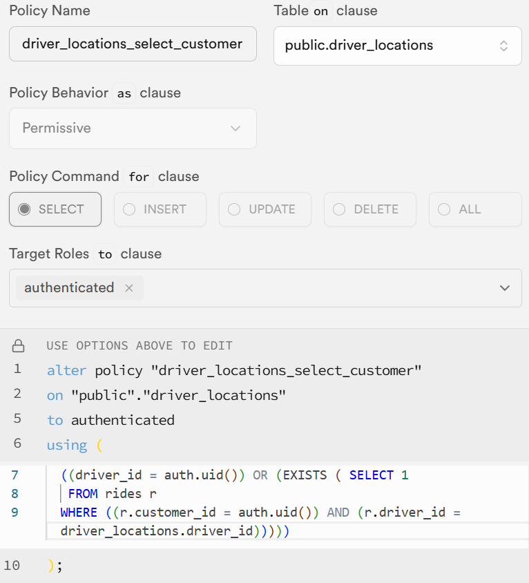{width=300px}

Um Benutzeroberflächen in Echtzeit an Datenbankänderungen anzupassen, wird in Supabase die Realtime-Funktion verwendet. Dazu muss Realtime für die jeweilige Tabelle in Supabase aktiviert und in der Flutter-App eine Realtime-Subscription eingerichtet werden. In der Kunden-App kommt dies bei der Tabelle `rides` zum Einsatz, um den Fahrtenstatus live zu aktualisieren und Benachrichtigungen zu versenden.

Das Szenario ist wie folgt: Ein Benutzer erstellt eine Fahrt, deren Status zunächst auf `requested` gesetzt ist. Diese Fahrt wird im Screen der App angezeigt. Sobald der Status in der Datenbank z. B. auf `assigned` geändert wird, aktualisiert sich die UI automatisch und der neue Status wird angezeigt.

Die folgende Realtime-Subscription zeigt, wie Änderungen an Fahrten des aktuellen Benutzers abonniert und in der UI verarbeitet werden:
```dart
// Realtime-Subscription nur für die Rides des aktuellen Kunden
RealtimeChannel subscribeToRides(
  String customerId,
  void Function(PostgresChangePayload) callback,
) {
  final channel = client.channel('public:rides:customer:$customerId');

  for (final event in [
    PostgresChangeEvent.insert,
    PostgresChangeEvent.update,
    PostgresChangeEvent.delete,
  ]) {
    channel.onPostgresChanges(
      event: event,
      schema: 'public',
      table: 'rides',
      filter: PostgresChangeFilter(
        type: PostgresChangeFilterType.eq,
        column: 'customer_id',
        value: customerId,
      ),
      callback: callback, // wird im Screen ausgewertet
    );
  }

  channel.subscribe();
  return channel;
}
// Subscription einrichten und UI aktualisieren
@override
void initState() {
  super.initState();
  _loadRides();              // Initiales Laden
  _setupRealtimeSubscription(); // Realtime starten
}

void _setupRealtimeSubscription() {
  final userId = _supabaseService.currentUser?.id;
  if (userId == null) return;

  _subscription = _supabaseService.subscribeToRides(
    userId,
    _handleRealtimeUpdate,
  );
}

void _handleRealtimeUpdate(PostgresChangePayload payload) {
  if (!mounted) return;

  switch (payload.eventType) {
    case PostgresChangeEvent.delete:
      final id = (payload.oldRecord['id'] as num?)?.toInt();
      if (id != null) {
        setState(() => _rides.removeWhere((ride) => ride.id == id));
      }
      break;

    case PostgresChangeEvent.insert:
    case PostgresChangeEvent.update:
      _refreshSingleRide(payload.newRecord['id'] as int);
      break;
    default:
      break;
  }
}

Future<void> _refreshSingleRide(int rideId) async {
  try {
    final updatedRide = await _supabaseService.getRideById(rideId);
    if (mounted) {
      setState(() {
        final index = _rides.indexWhere((ride) => ride.id == rideId);
        if (index >= 0) {
          _rides[index] = updatedRide; // UI sofort aktualisieren
        } else {
          _rides.insert(0, updatedRide); // neue Fahrt oben einfügen
        }
      });
    }
  } catch (e) {
    debugPrint('Failed to refresh ride $rideId: $e'); // Fehler bei Einzel-Update ignorieren
  }
}
```
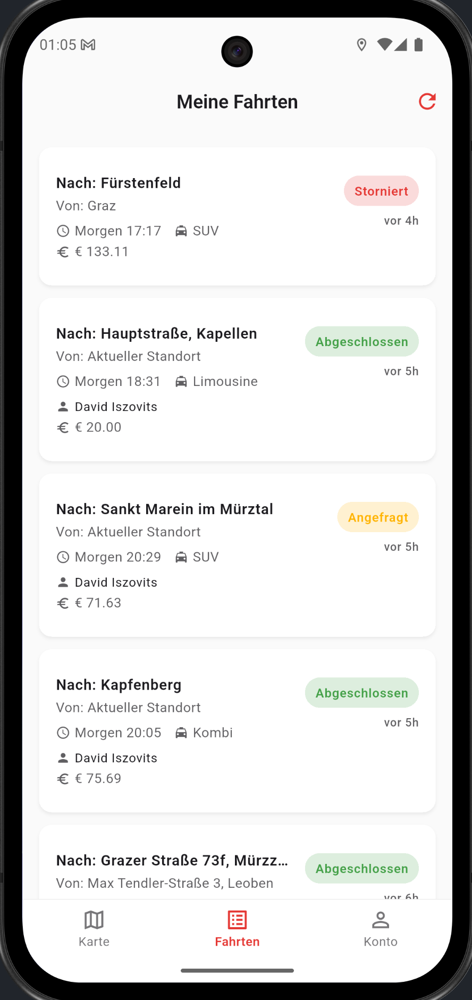{width=300px}

### UI-Grundgerüst & Navigation

Die App nutzt ein Auth-Gate, das auf den Supabase-Auth-Stream hört. Direkt nach dem Start prüft es, ob eine aktive Session vorhanden ist: Nicht eingeloggte Nutzer sehen Login/Registrierung, verifizierte Nutzer gelangen in die Haupt-Shell. Nach erfolgreicher E-Mail-Bestätigung landet der User automatisch im Hauptbereich.
```dart
class AuthGate extends StatelessWidget {
  final _supabase = Supabase.instance.client;

  @override
  Widget build(BuildContext context) {
    return StreamBuilder<AuthState>(
      stream: _supabase.auth.onAuthStateChange,
      builder: (context, snapshot) {
        final session = snapshot.data?.session ?? _supabase.auth.currentSession;
        if (session == null) return const LoginPage();
        return const MainShell(); // BottomNavigationBar-Shell
      },
    );
  }
}
```

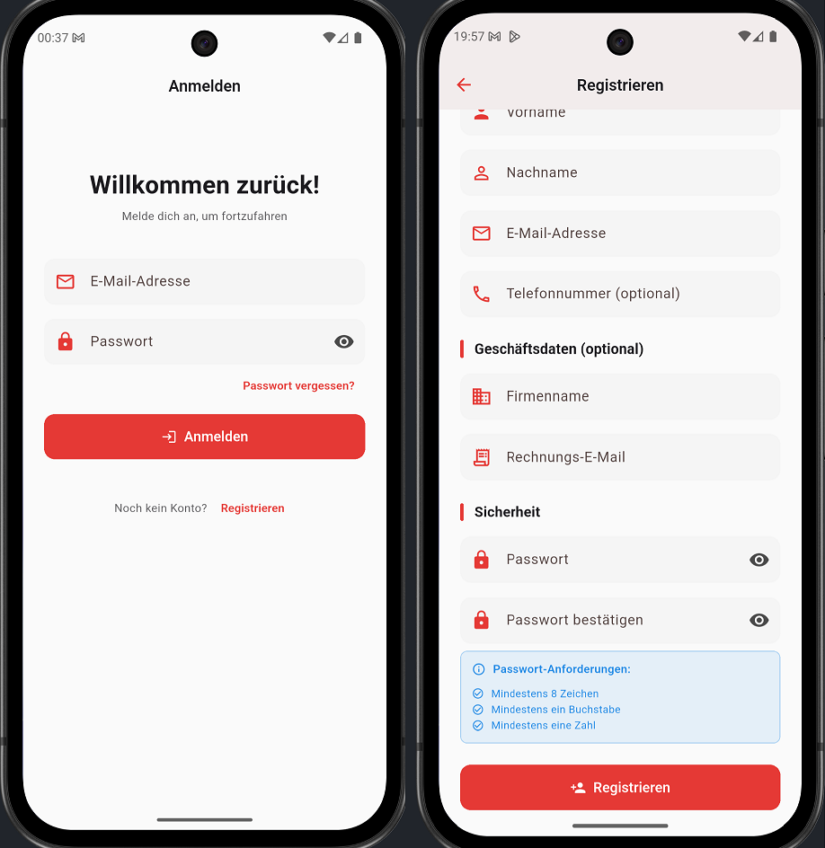{width=300px}

Die Hauptnavigation ist als `BottomNavigationBar` (bzw. `NavigationBar`) umgesetzt und hält den aktuellen Tab-Index im State, sodass beim Wechsel kein erneutes Laden der Tabs nötig ist. Typische Tabs sind „Fahrten/Activity“ (Liste eigener Fahrten mit Realtime-Status), „Buchen/Karte“ (Routing, Adresssuche, Fahrer-Tracking) und „Profil/Settings“ (Theme-Umschaltung, Logout).
```dart
class MainShell extends StatefulWidget {
  const MainShell({super.key});

  @override
  State<MainShell> createState() => _MainShellState();
}

class _MainShellState extends State<MainShell> {
  int _index = 0;
  final _pages = [const ActivityPage(), const BookingPage(), const ProfilePage()];

  @override
  Widget build(BuildContext context) {
    return Scaffold(
      body: _pages[_index],
      bottomNavigationBar: NavigationBar(
        selectedIndex: _index,
        onDestinationSelected: (i) => setState(() => _index = i),
        destinations: const [
          NavigationDestination(icon: Icon(Icons.list_alt), label: 'Fahrten'),
          NavigationDestination(icon: Icon(Icons.map), label: 'Buchen'),
          NavigationDestination(icon: Icon(Icons.person), label: 'Profil'),
        ],
      ),
    );
  }
}
```

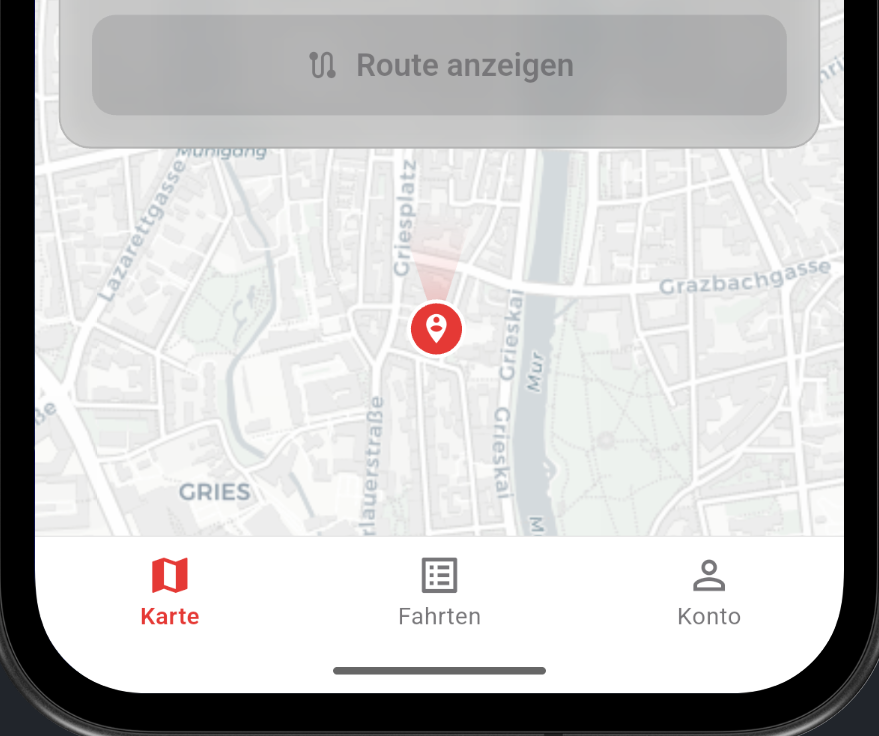{width=300px}

Für Detailseiten (z. B. Ride-Detail, Zahlung, Einstellungen) werden benannte Routen genutzt. Über einen globalen `navigatorKey` (`AppNavigator`) können auch Services wie Notifications ohne BuildContext in bestimmte Screens navigieren (z. B. direkt in eine Fahrt nach einer Status-Notification).

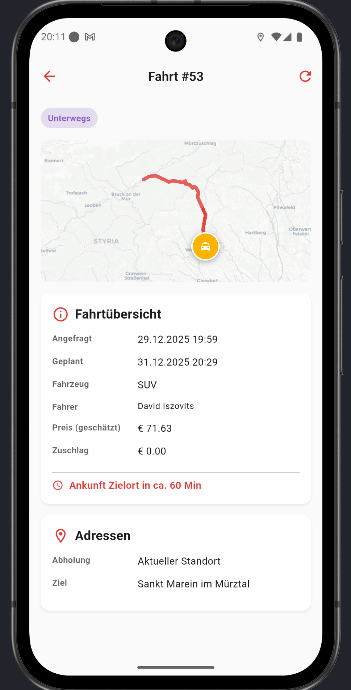{width=300px}

Die Theme-Verwaltung wird zentral in `config/theme.dart` gepflegt. Ein `ThemeProvider` (Provider/ChangeNotifier) schaltet zwischen Light/Dark und speichert die Auswahl in `shared_preferences`, sodass das gewählte Theme appweit und dauerhaft gilt.

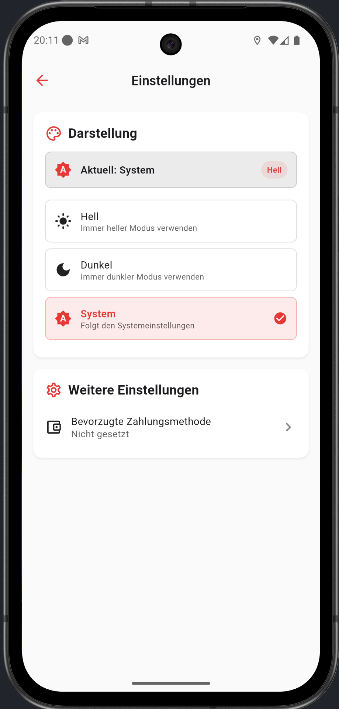{width=300px}

Wesentliche Screens im Überblick:
- Login/Registrierung: E-Mail/Passwort, Fehlerrückmeldung direkt aus Supabase
- Activity-Liste: Fahrtenübersicht mit Realtime-Updates des Status
- Ride-Detail: Status, Route, Zahlungsinfos, ggf. Stornieren
- Profil/Settings: Theme-Switch, Logout

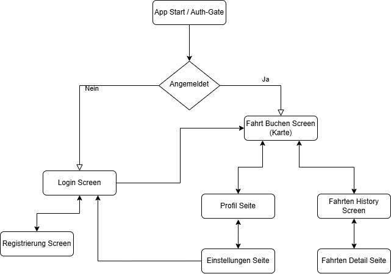{width=300px}

Durch dieses Navigations- und UI-Grundgerüst entsteht eine klar strukturierte und erweiterbare App, in der Authentifizierung, Kartenfunktionen, Fahrtenverwaltung und Bezahlung logisch miteinander verbunden sind.

### Standort & Karten 

Die Implementierung der Standort- und Kartenfunktionalität ist ein zentrales Element der Kunden-App. Der `LocationService` kapselt die gesamte Logik für Berechtigungen und Positionsbestimmung. Beim Initialisieren der App wird zunächst `initialize()` aufgerufen, das nacheinander prüft, ob Standortdienste aktiviert sind, die erforderliche Berechtigung anfordert und die initiale Position bestimmt. Der Service arbeitet als Singleton und stellt einen `Stream<LatLng>` bereit, über den die UI fortlaufend Positionsupdates erhält.

```dart
Future<bool> initialize() async {
  _isLocationServiceEnabled = await Geolocator.isLocationServiceEnabled();
  if (!_isLocationServiceEnabled) return false;

  final permissionGranted = await requestLocationPermission();
  if (!permissionGranted) return false;

  await getCurrentPosition();
  return true;
}
```

Im Home-Screen wird dieser Stream abonniert und bei jedem Update wird `_currentLocation` aktualisiert sowie die Kartensicht entsprechend angepasst. Dies ermöglicht es dem Nutzer, seine aktuelle Position jederzeit zu sehen.

Für die Kartendarstellung wird das Package `flutter_map` in Kombination mit OpenStreetMap-Tiles eingesetzt. Das zentrale `TaxiMap`-Widget ist theme-aware und rendert je nach Light/Dark-Mode unterschiedliche Kartenkacheln. Dadurch wird eine konsistente visuelle Erfahrung über die gesamte App gewährleistet. Das `CurrentLocationLayer`-Widget, das von `flutter_map_location_marker` bereitgestellt wird, zeigt die Live-Position des Nutzers als dynamischen Marker mit Genauigkeitskreis an. Dieser wird nur angezeigt, wenn der `LocationService` eine gültige Permission und aktive Standortdienste meldet.

```dart
if (widget.showCurrentLocation && _locationService.isLocationAvailable)
  CurrentLocationLayer(
    alignPositionOnUpdate: widget.followCurrentLocation
        ? AlignOnUpdate.always
        : AlignOnUpdate.never,
    style: LocationMarkerStyle(
      marker: DefaultLocationMarker(
        color: AppTheme.primary,
        child: const Icon(Icons.person_pin_circle, color: Colors.white),
      ),
      markerSize: const Size(30, 30),
      accuracyCircleColor: AppTheme.primary.withOpacity(0.12),
    ),
  ),
```

Zusätzlich zur Live-Position des Nutzers werden in der Karte auch Pickup- und Dropoff-Marker sowie der aktuelle Fahrstandort angezeigt. Diese werden dynamisch gesetzt und ermöglichen es dem Nutzer, die Fahrt visuell zu verfolgen.

In der Ride-Detail-Ansicht wird Live-Tracking aktiviert, sobald die Fahrt aktiv ist und ein Fahrer zugewiesen wurde. Ein Realtime-Channel aus Supabase liefert kontinuierlich die Fahrerpositionen. Bei jedem Update wird eine neue Route berechnet – entweder vom Fahrer zum Pickup-Punkt (Status `assigned`) oder vom Fahrer zum Zieldestination (Status `in_progress`). Diese Route wird als Polyline auf der Karte eingeblendet, und die geschätzte Ankunftszeit (ETA) wird aktualisiert. Auf diese Weise sieht der Nutzer in Echtzeit, wo sich der Fahrer befindet und wie lange es noch dauert.

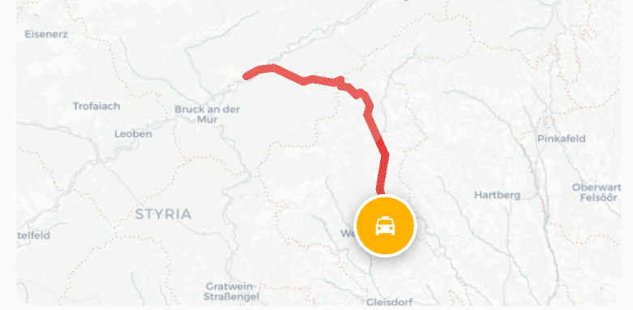{width=300px}

Fehlerhafte oder fehlende Berechtigungen werden dem Nutzer durch aussagekräftige Fehlermeldungen mitgeteilt. Der Service stellt zudem Debug-Informationen zur Verfügung, die bei der Entwicklung und beim Troubleshooting hilfreich sind.

Die Kombination aus `geolocator` (Positionsbestimmung), `permission_handler` (Berechtigung), `flutter_map` (Kartendarstellung) und `flutter_map_location_marker` (Live-Marker) erzeugt eine nahtlose, benutzerfreundliche Kartenerfahrung, die die Realtime-Daten aus Supabase nutzt und diese visuell darstellt.

### Suche & Geocoding

Für die Suche von Abhol- und Zielort werden die Packages `nominatim_flutter` und `flutter_typeahead` kombiniert eingesetzt. Diese ermöglichen es dem Nutzer, Adressen komfortabel zu suchen und auszuwählen, ohne die gesamte Adresse manuell eintippen zu müssen.

Das Package `flutter_typeahead` stellt ein Such-Eingabefeld bereit, das während der Eingabe automatisch Vorschläge anzeigt. Diese Vorschläge werden durch Nominatim (OpenStreetMap-Geocoding-Service) über `nominatim_flutter` generiert. Während der Benutzer tippt, werden entsprechende Ortsvorschläge geladen und angezeigt. Durch das Anklicken eines Vorschlags wird das Textfeld automatisch gefüllt und die entsprechenden Koordinaten (Latitude/Longitude) werden abgerufen.
```dart
TypeAheadField<GeocodingResult>(
  textFieldConfiguration: TextFieldConfiguration(
    controller: _addressController,
    decoration: InputDecoration(
      hintText: 'Adresse eingeben',
      border: OutlineInputBorder(),
    ),
  ),
  hideOnEmpty: true,
  debounceDuration: Duration(milliseconds: 400),
  suggestionsCallback: (pattern) async {
    if (pattern.isEmpty) return [];
    try {
      final results = await _geocodingHelper.searchAddress(pattern);
      return results;
    } catch (e) {
      return [];
    }
  },
  itemBuilder: (context, suggestion) {
    return ListTile(
      title: Text(suggestion.address),
      subtitle: Text(suggestion.displayName ?? ''),
    );
  },
  onSuggestionSelected: (suggestion) {
    _addressController.text = suggestion.address;
    setState(() {
      _selectedCoordinates = LatLng(suggestion.lat, suggestion.lon);
    });
  },
)
```
Im Backend wird ein `GeocodingHelper`-Service eingesetzt, der die Kommunikation mit Nominatim abstrahiert und sowohl Forward-Geocoding (Adresse -> Koordinaten) als auch Reverse-Geocoding (Koordinaten -> Adresse) unterstützt. Dies ermöglicht es, die aktuelle Position des Nutzers automatisch in eine Adresse zu konvertieren und diese dann im Eingabefeld anzuzeigen.

Die Adresssuche wird mit einem sogenannten Debounce-Mechanismus verzögert (z. B. 400 ms). Dabei wird eine Anfrage erst gesendet, wenn der Nutzer kurz mit der Eingabe pausiert. Dadurch werden unnötig viele Anfragen verhindert und die Bedienbarkeit verbessert.

Nach Auswahl einer Adresse werden die Koordinaten extrahiert und für die nachfolgende Routenberechnung verwendet. Auf diese Weise entsteht ein nahtloser Workflow: Benutzer gibt Adresse ein -> Vorschläge werden angezeigt -> Nutzer wählt Vorschlag -> Koordinaten werden gespeichert -> Route wird berechnet.

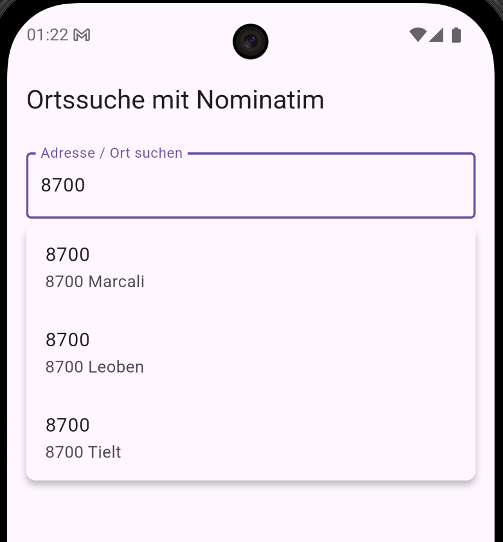{width=300px}

Die Kombination aus `nominatim_flutter` (Geocoding) und `flutter_typeahead` (Autovervollständigung) erzeugt eine benutzerfreundliche Suchfunktion, die die Eingabe von Abhol- und Zielortsadressen erheblich vereinfacht.

### Routing & Distanzberechnung

Für die Berechnung von Routen zwischen zwei geografischen Punkten wird der Dienst **OSRM (Open Source Routing Machine)** verwendet. OSRM ist ein hochoptimierter Routing-Engine, der auf OpenStreetMap-Daten basiert und Routen für verschiedene Fortbewegungsarten (Auto, Fahrrad, zu Fuß) berechnet.

Die Kommunikation mit OSRM erfolgt über HTTP-Anfragen. Der `RoutingService` kapselt diese Logik und sendet die Koordinaten von Start- und Zielpunkt an die OSRM-API. Die API gibt daraufhin die optimale Route sowie zusätzliche Informationen wie Distanz und Fahrtdauer zurück.

```dart
Future<RouteResult> calculateRoute(LatLng start, LatLng end) async {
  try {
    final url = '$_osrmBaseUrl/route/v1/driving/'
        '${start.longitude},${start.latitude};'
        '${end.longitude},${end.latitude}'
        '?overview=full&steps=true';

    final response = await http.get(Uri.parse(url)).timeout(
      const Duration(seconds: 10),
      onTimeout: () {
        throw Exception('OSRM API timeout');
      },
    );

    if (response.statusCode == 200) {
      final data = jsonDecode(response.body);
      final routes = data['routes'] as List;
      
      if (routes.isEmpty) {
        throw Exception('Keine Route gefunden');
      }

      final route = routes[0];
      final geometry = route['geometry'] as Map;
      final coordinates = _decodePolyline(geometry['coordinates']);
      
      return RouteResult(
        coordinates: coordinates,
        distanceKilometers: (route['distance'] as num) / 1000,
        durationMinutes: (route['duration'] as num) / 60,
      );
    } else {
      throw Exception('OSRM Fehler: ${response.statusCode}');
    }
  } catch (e) {
    debugPrint('Routenberechnung fehlgeschlagen: $e');
    rethrow;
  }
}
```
Die von OSRM zurückgelieferten Koordinaten werden in eine Liste von `LatLng`-Objekten umgewandelt und anschließend als Polyline auf der Karte dargestellt. Das `TaxiMap`-Widget akzeptiert eine Liste von `Polyline`-Objekten, die über ein spezialisiertes `RoutePolylines-Utility` erstellt werden.
```dart
static List<Polyline> createMainRoute(List<LatLng> points) {
  if (points.isEmpty) return [];

  return [
    // Schatten-Effekt für bessere Sichtbarkeit
    Polyline(
      points: points,
      strokeWidth: 8,
      color: Colors.black.withOpacity(0.35),
    ),
    // Hauptroute in App-Primärfarbe
    Polyline(
      points: points,
      strokeWidth: 4.5,
      color: AppTheme.primary,
    ),
  ];
}
```
Aus den Daten von OSRM werden auch die geschätzte Fahrtdauer (ETA – Estimated Time of Arrival) und die Gesamtdistanz extrahiert. Diese Informationen werden dem Nutzer angezeigt und dienen zudem als Grundlage für die Fahrpreisberechnung. Der Preis wird auf Basis eines konfigurierbaren Tarifs berechnet, z. B. Basisbetrag + Kilometerpreis + Zeitpreis.

```dart
double estimateFare({
  required double distanceKm,
  required double durationMinutes,
}) {
  const baseFare = 2.50;
  const pricePerKm = 0.75;
  const pricePerMinute = 0.08;

  final distanceCost = distanceKm * pricePerKm;
  final timeCost = durationMinutes * pricePerMinute;
  
  return baseFare + distanceCost + timeCost;
}
```

In der Ride-Detail-Ansicht wird die Route kontinuierlich aktualisiert, wenn sich die Fahrposition ändert. Bei jedem Positions-Update wird eine neue Routenberechnung vom Fahrer zum nächsten Zwischenziel (Pickup oder Destination) durchgeführt, und die ETA wird neu berechnet. Dies ermöglicht es dem Nutzer, die verbleibende Fahrtdauer in Echtzeit zu sehen.

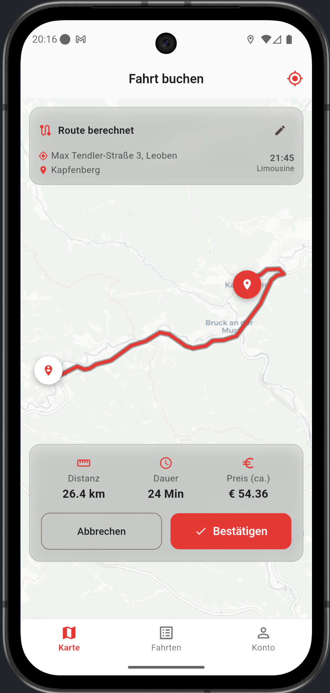{width=300px}

Die enge Integration von Standortdaten (Location-Stream), Routenberechnung (OSRM) und Kartendarstellung (flutter_map) erzeugt ein kohärentes System, das dem Nutzer kontinuierlich aktualisierte Informationen über seine Fahrt bereitstellt.

### Buchungs- und Zahlungsprozess

Der Zahlungsfluss startet bereits im Booking-Form: Beim Anlegen der Fahrt wird die Zahlungsmethode (Bar oder Karte) gewählt und gleichzeitig ein Payment-Eintrag in Supabase mit Status `pending` angelegt. Nach Abschluss der Fahrt wird im Payment-Form die eigentliche Zahlung abgeschlossen – entweder per SumUp-Sandbox (Karte) oder durch Fahrerbestätigung (Bar). Die UI richtet sich strikt nach dem Payment-Status.

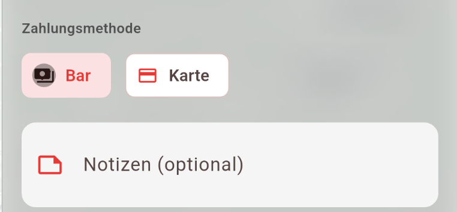{width=320px}
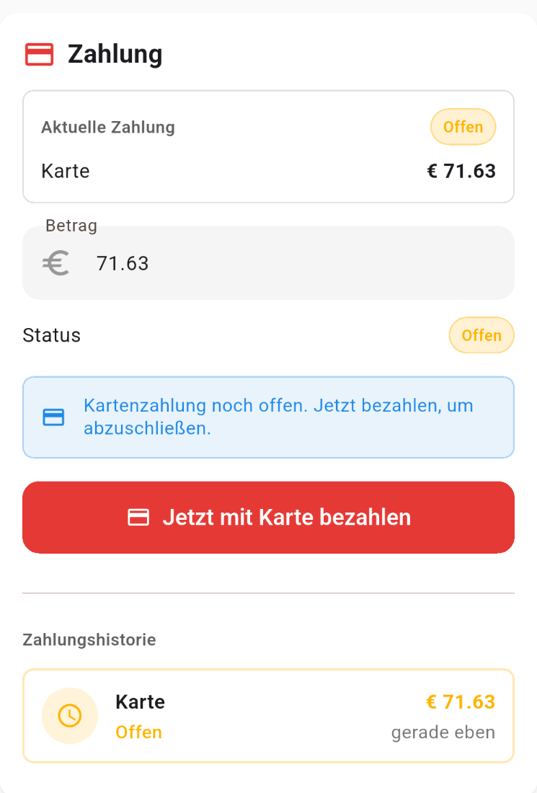{width=320px}
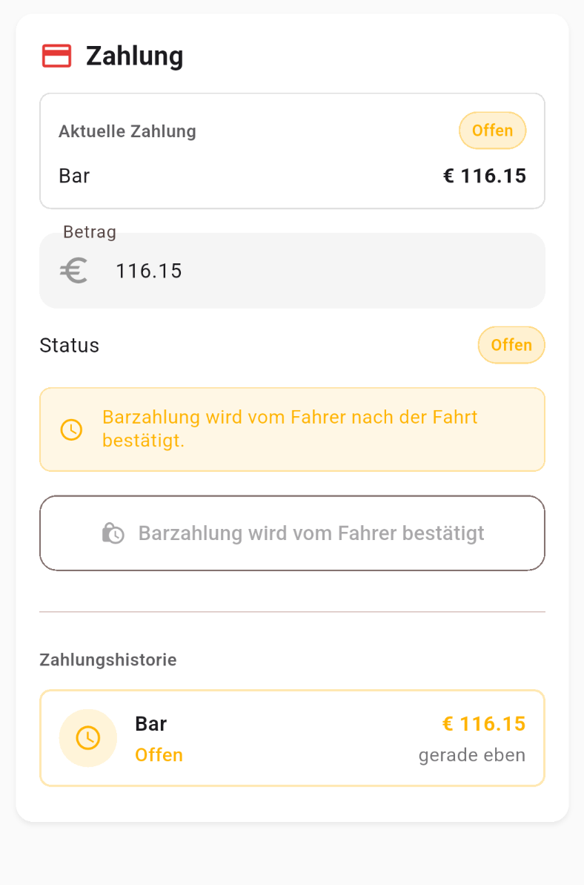{width=320px}

**Ablauf und Statuslogik**
- booking_form: Fahrt erstellen, Payment-Datensatz (payment_method, amount, status = pending) anlegen.
- payment_form: Betrag und Status anzeigen; bei pending Bezahl-CTA aktiv, bei paid deaktiviert/ausgeblendet.
- Kartenzahlung: SumUp-Checkout (Sandbox) erzeugen; bei Erfolg Status auf paid, bei Fehler/Timeout verbleibt pending mit Fehlermeldung.
- Barzahlung: Betrag wird extern kassiert; der Fahrer bestätigt in seiner App, die Payment-Zeile wechselt auf paid.
- UI reagiert live auf Payment-Status (Badges/Farben/CTA).

**Fehler- und Konsistenzhandling**
- Zeitüberschreitungen/4xx/5xx der SumUp-API lassen den Datensatz auf pending und zeigen eine Nutzerhinweis-Meldung.
- Keine Doppeleinträge: Payment wird nur einmal bei der Buchung erstellt und anschließend in-place auf paid gesetzt.
- Realtime-Updates (optional) können den Payment-Status sofort in Listen/Detailansicht spiegeln.

```dart
// Booking-Form (verkürzt): Zahlungsmethode wählen und Payment anlegen
Future<void> _submitBooking() async {
  final method = _selectedMethod; // 'cash' oder 'card'
  final rideId = await _ridesService.createRide(
    pickup: _pickup,
    dropoff: _dropoff,
    paymentMethod: method,
  );

  await _paymentsService.createPayment(
    rideId: rideId,
    amount: _calculatedFare,
    method: method,
    status: 'pending',
  );

  if (!mounted) return;
  Navigator.pop(context); // zurück zur Übersicht
}

// Payment-Form mit SumUp-Sandbox und Status-UI
class PaymentForm extends StatefulWidget {
  const PaymentForm({super.key, required this.paymentId});
  final int paymentId;

  @override
  State<PaymentForm> createState() => _PaymentFormState();
}

class _PaymentFormState extends State<PaymentForm> {
  Payment? _payment;
  bool _loading = false;
  String? _error;

  @override
  void initState() {
    super.initState();
    _loadPayment();
  }

  Future<void> _loadPayment() async {
    final p = await _paymentsService.getPayment(widget.paymentId);
    if (!mounted) return;
    setState(() => _payment = p);
  }

  Future<void> _payByCard() async {
    if (_payment == null) return;
    setState(() {
      _loading = true;
      _error = null;
    });

    try {
      await _sumupService.createCheckout(
        amount: _payment!.amount,
        currency: 'EUR',
        reference: 'ride-${_payment!.rideId}',
      );
      await _paymentsService.updateStatus(_payment!.id, 'paid');
      await _loadPayment();
    } catch (e) {
      setState(() => _error = 'Zahlung fehlgeschlagen, bitte erneut versuchen.');
    } finally {
      if (mounted) setState(() => _loading = false);
    }
  }

  @override
  Widget build(BuildContext context) {
    final payment = _payment;
    if (payment == null) return const Center(child: CircularProgressIndicator());

    final isPaid = payment.status == 'paid';
    final isCash = payment.method == 'cash';

    return Column(
      crossAxisAlignment: CrossAxisAlignment.start,
      children: [
        Text('Betrag: ${payment.amount.toStringAsFixed(2)} EUR'),
        Text('Methode: ${isCash ? 'Bar' : 'Karte'}'),
        Text('Status: ${payment.status}'),
        if (_error != null) Text(_error!, style: const TextStyle(color: Colors.red)),
        const SizedBox(height: 12),
        if (!isPaid && !isCash)
          ElevatedButton(
            onPressed: _loading ? null : _payByCard,
            child: _loading ? const CircularProgressIndicator() : const Text('Bezahlen'),
          ),
        if (!isPaid && isCash)
          const Text('Warten auf Fahrerbestätigung (Barzahlung).'),
        if (isPaid)
          const Text('Bereits bezahlt.', style: TextStyle(color: Colors.green)),
      ],
    );
  }
}
```

### Dokumente & Drucken

Nach Abschluss einer Fahrt kann der Kunde eine Rechnung als PDF erzeugen und lokal speichern oder direkt teilen. Die App nutzt dafür die Pakete `pdf` (Dokument generieren) und `printing` (Speichern/Teilen-Dialog). Die Rechnung enthält Fahrtdaten (Datum, Start/Ziel, Distanz, Dauer), Preisdetails sowie Zahlungsart und -status.

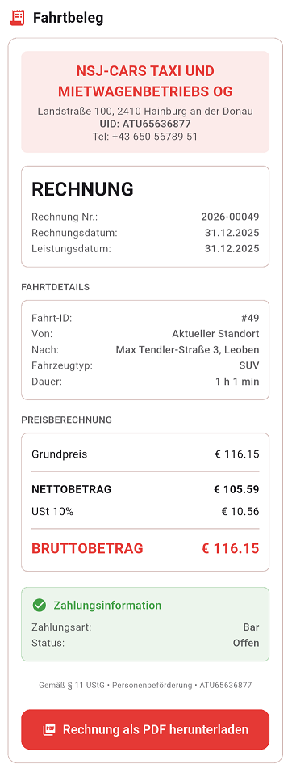{width=320px}
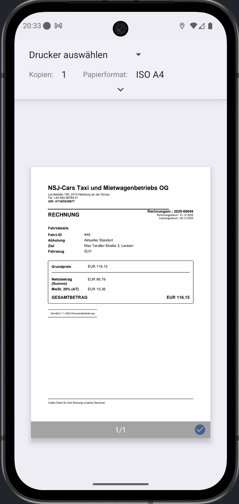{width=320px}

**Ablauf**
- Fahrtdaten laden (Ride + Payment) und in ein PDF-Datenmodell mappen.
- PDF mit `pdf`-Package rendern (Logo/Kopfzeile, Rechnungsnummer, Positionen, Summe, Zahlungsstatus).
- Über `printing` als Datei speichern oder per Share-Intent versenden.

**Fehler-Handling**
- Falls Ride/Payment nicht geladen werden kann: Hinweis anzeigen, kein PDF generieren.
- Bei fehlenden Dateiberechtigungen (Android < 10) Hinweis ausgeben; auf neueren Versionen nur App-intern speichern/teilen.

```dart
// PDF-Erzeugung (vereinfacht)
Future<Uint8List> buildInvoicePdf({
  required Ride ride,
  required Payment payment,
}) async {
  final doc = pw.Document();
  doc.addPage(
    pw.Page(
      build: (ctx) => pw.Column(
        crossAxisAlignment: pw.CrossAxisAlignment.start,
        children: [
          pw.Text('Rechnung', style: pw.TextStyle(fontSize: 22, fontWeight: pw.FontWeight.bold)),
          pw.SizedBox(height: 12),
          pw.Text('Fahrt-ID: ${ride.id}'),
          pw.Text('Datum: ${ride.startedAt}'),
          pw.Text('Von: ${ride.pickupAddress}'),
          pw.Text('Nach: ${ride.dropoffAddress}'),
          pw.SizedBox(height: 12),
          pw.Text('Distanz: ${ride.distanceKm.toStringAsFixed(2)} km'),
          pw.Text('Dauer: ${ride.durationMin.toStringAsFixed(0)} min'),
          pw.SizedBox(height: 12),
          pw.Text('Betrag: ${payment.amount.toStringAsFixed(2)} EUR'),
          pw.Text('Zahlungsart: ${payment.method}'),
          pw.Text('Status: ${payment.status}'),
        ],
      ),
    ),
  );
  return doc.save();
}

// Speichern/Teilen via printing
Future<void> shareOrSaveInvoice(Ride ride, Payment payment) async {
  try {
    final pdfBytes = await buildInvoicePdf(ride: ride, payment: payment);
    await Printing.sharePdf(bytes: pdfBytes, filename: 'invoice_${ride.id}.pdf');
    // Alternativ: await Printing.layoutPdf(onLayout: (_) => pdfBytes);
  } catch (e) {
    debugPrint('PDF-Export fehlgeschlagen: $e');
  }
}
```

### Lokale Benachrichtigungen & Realtime Updates

Die App nutzt `flutter_local_notifications`, um Nutzer bei wichtigen Ereignissen ihrer Fahrt zu informieren: Fahrer hat angenommen, Fahrt startet, Fahrt endet. Die Trigger kommen aus Supabase-Realtime-Events (Tabelle `rides`), die lokal ausgewertet werden. Jede Notification enthält einen Titel, einen kurzen Status-Text und optional eine Payload mit der Ride-ID, sodass beim Tippen direkt der passende Detail-Screen geöffnet werden kann.

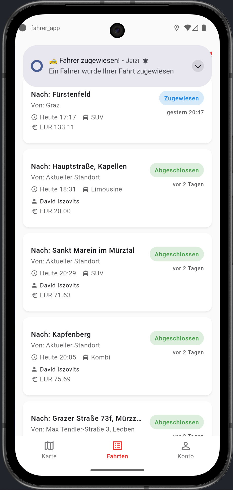{width=320px}
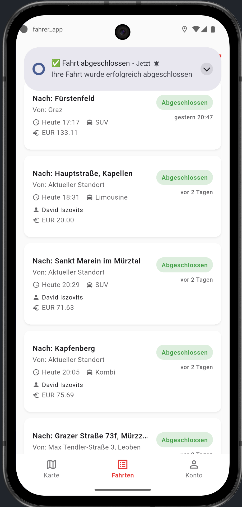{width=320px}

**Ablauf**
- Realtime-Subscription auf `rides` des aktuellen Nutzers (Statusänderungen: `assigned`, `in_progress`, `completed`).
- Bei relevantem Status ruft der Client den `NotificationService` auf und zeigt eine lokale Notification.
- Tippt der Nutzer auf die Notification, navigiert die App (über einen globalen NavigatorKey) direkt zur Ride-Detailseite.

**Fehler-Handling & Berechtigungen**
- Beim Initialisieren: Berechtigung für Notifications einholen (iOS Prompt, Android 13+ `POST_NOTIFICATIONS`).
- Fällt Realtime aus oder liefert Fehler, wird die UI weiter aktualisiert, aber es gibt keinen Notification-Push; Logging hilft bei Debugging.

```dart
// NotificationService (auszugsweise)
class NotificationService {
  static final _plugin = FlutterLocalNotificationsPlugin();

  static Future<void> init() async {
    const settingsAndroid = AndroidInitializationSettings('@mipmap/ic_launcher');
    const initSettings = InitializationSettings(android: settingsAndroid);
    await _plugin.initialize(
      initSettings,
      onDidReceiveNotificationResponse: _onSelectNotification,
    );
  }

  static Future<void> showRideStatus({
    required int rideId,
    required String title,
    required String body,
  }) async {
    const details = NotificationDetails(
      android: AndroidNotificationDetails(
        'rides_channel',
        'Rides',
        importance: Importance.high,
        priority: Priority.high,
      ),
    );
    await _plugin.show(rideId, title, body, details, payload: '$rideId');
  }

  static void _onSelectNotification(NotificationResponse response) {
    final rideId = int.tryParse(response.payload ?? '');
    if (rideId != null) {
      AppNavigator.toRideDetail(rideId); // globaler navigatorKey -> Detail-Screen
    }
  }
}

// Realtime-Callback (vereinfacht)
void handleRideUpdate(PostgresChangePayload payload) {
  final status = payload.newRecord['status'] as String?;
  final rideId = (payload.newRecord['id'] as num?)?.toInt();
  if (rideId == null || status == null) return;

  switch (status) {
    case 'assigned':
      NotificationService.showRideStatus(
        rideId: rideId,
        title: 'Fahrer unterwegs',
        body: 'Dein Fahrer hat die Fahrt angenommen.',
      );
      break;
    case 'in_progress':
      NotificationService.showRideStatus(
        rideId: rideId,
        title: 'Fahrt gestartet',
        body: 'Deine Fahrt hat begonnen.',
      );
      break;
    case 'completed':
      NotificationService.showRideStatus(
        rideId: rideId,
        title: 'Fahrt beendet',
        body: 'Danke für die Fahrt! Rechnung ist bereit.',
      );
      break;
    default:
      break;
  }
}
```

### Lokalisierung & Formatierung

Die App ist auf Deutsch lokalisiert, sodass systemnahe Widgets (z. B. DatePicker) deutschsprachige Texte verwenden. Zentrale Datums- und Währungsformatierungen werden über das `intl`-Package definiert und in der gesamten App wiederverwendet (z. B. ISO-Parsing, Anzeige im EU-Format, Währungsdarstellung in EUR). `flutter_localizations` wird in `MaterialApp` aktiviert, damit Standard-Widgets die gewünschte Locale übernehmen.

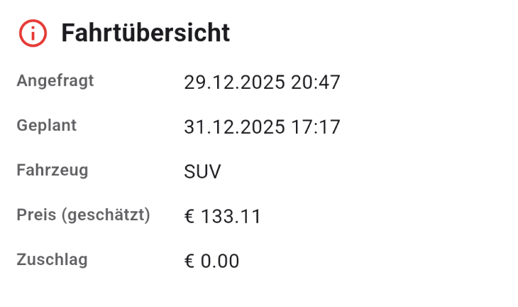{width=320px}

**Schritte**
- In `MaterialApp`: `supportedLocales` auf `Locale('de')`, `localizationsDelegates` aktivieren.
- Zentrale Formatter (Datum/Uhrzeit/Währung) in einer Helper-Klasse bündeln und überall nutzen.
- Eingehende Strings (z. B. ISO aus Backend) parsen, dann formatiert ausgeben.

**Beispiel-Formatter**
- Datum kurz: `dd.MM.yyyy`
- Datum/Zeit: `dd.MM.yyyy HH:mm`
- Währung: `NumberFormat.simpleCurrency(locale: 'de_AT', name: 'EUR')`

```dart
// Beispiel: zentrale Formatter
class Formatters {
  static final date = DateFormat('dd.MM.yyyy', 'de_DE');
  static final dateTime = DateFormat('dd.MM.yyyy HH:mm', 'de_DE');
  static final currency = NumberFormat.simpleCurrency(locale: 'de_DE', name: 'EUR');

  static String formatDate(DateTime dt) => date.format(dt);
  static String formatDateTime(DateTime dt) => dateTime.format(dt);
  static String formatCurrency(num value) => currency.format(value);
}

// MaterialApp-Konfiguration (Ausschnitt)
return MaterialApp(
  supportedLocales: const [Locale('de')],
  localizationsDelegates: const [
    GlobalMaterialLocalizations.delegate,
    GlobalWidgetsLocalizations.delegate,
    GlobalCupertinoLocalizations.delegate,
  ],
  // ...
);

// Nutzung im UI
Text('Abfahrt: ${Formatters.formatDateTime(ride.startedAt)}');
Text('Preis: ${Formatters.formatCurrency(ride.price)}');
```

### State-Management mit Provider

Für globale Zustände wie das App-Theme wird `provider` mit `ChangeNotifier` eingesetzt. Ein `ThemeProvider` hält den aktuellen Modus (Hell/Dunkel), persistiert ihn in `shared_preferences` und benachrichtigt die UI per `notifyListeners()`. Über `Consumer` oder `context.watch()` reagieren Widgets unmittelbar auf Änderungen. So bleibt der Theme-Wechsel konsistent und erfordert kein manuelles Weiterreichen des Zustands durch die Widget-Hierarchie.

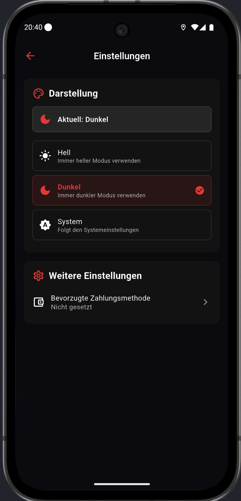{width=320px}

**Ablauf**
- App-Start: Theme aus `shared_preferences` lesen, initial setzen.
- Toggle im UI: Provider aktualisiert State, speichert Auswahl, ruft `notifyListeners()`.
- `MaterialApp` bezieht `theme`/`darkTheme` aus dem Provider, Widgets rebuilden automatisch.

```dart
// ThemeProvider mit Persistenz
class ThemeProvider extends ChangeNotifier {
  ThemeMode _mode = ThemeMode.system;

  ThemeMode get mode => _mode;

  Future<void> load() async {
    final prefs = await SharedPreferences.getInstance();
    final value = prefs.getString('theme_mode');
    _mode = switch (value) {
      'light' => ThemeMode.light,
      'dark' => ThemeMode.dark,
      _ => ThemeMode.system,
    };
    notifyListeners();
  }

  Future<void> setMode(ThemeMode mode) async {
    _mode = mode;
    final prefs = await SharedPreferences.getInstance();
    await prefs.setString('theme_mode', switch (mode) {
      ThemeMode.light => 'light',
      ThemeMode.dark => 'dark',
      _ => 'system',
    });
    notifyListeners();
  }
}

// MaterialApp-Einbindung (Ausschnitt)
return ChangeNotifierProvider(
  create: (_) => ThemeProvider()..load(),
  child: Consumer<ThemeProvider>(
    builder: (_, theme, __) {
      return MaterialApp(
        themeMode: theme.mode,
        theme: AppTheme.light,
        darkTheme: AppTheme.dark,
        // ...
      );
    },
  ),
);

// Toggle im UI (z. B. Switch)
Switch(
  value: context.watch<ThemeProvider>().mode == ThemeMode.dark,
  onChanged: (isDark) {
    context.read<ThemeProvider>().setMode(isDark ? ThemeMode.dark : ThemeMode.light);
  },
);
```

### Utilities & Wiederverwendbare Komponenten

- DateFormatter: zentrale Klasse für Datum/Zeit/Währung, damit Formatierungen konsistent und änderbar bleiben (z. B. Locale-Wechsel).
- ValidationHelper: kapselt typische Form-Validierungen (E-Mail, Pflichtfeld, Mindestlänge), um Redundanz in Forms zu vermeiden.
- Custom Widgets: kleine, wiederverwendbare UI-Bausteine wie `PrimaryButton`, `LabeledValue` oder `InfoBadge`, damit Styles und Abstände einheitlich sind.

```dart
class DateFormatter {
  static final _date = DateFormat('dd.MM.yyyy', 'de_DE');
  static final _dateTime = DateFormat('dd.MM.yyyy HH:mm', 'de_DE');

  static String date(DateTime dt) => _date.format(dt);
  static String dateTime(DateTime dt) => _dateTime.format(dt);
}

class ValidationHelper {
  static String? requiredField(String? v, {String message = 'Pflichtfeld'}) =>
      (v == null || v.trim().isEmpty) ? message : null;

  static String? minLength(String? v, int min, {String? message}) =>
      (v ?? '').trim().length < min ? (message ?? 'Mindestens $min Zeichen') : null;

  static String? email(String? v, {String message = 'Ungültige E-Mail'}) {
    final value = (v ?? '').trim();
    final regex = RegExp(r'^[^@\s]+@[^@\s]+\.[^@\s]+$');
    return regex.hasMatch(value) ? null : message;
  }
}
```

```dart
class PrimaryButton extends StatelessWidget {
  const PrimaryButton({super.key, required this.label, this.onPressed, this.icon});
  final String label;
  final VoidCallback? onPressed;
  final IconData? icon;

  @override
  Widget build(BuildContext context) {
    return ElevatedButton.icon(
      onPressed: onPressed,
      icon: Icon(icon ?? Icons.arrow_forward),
      label: Text(label),
      style: ElevatedButton.styleFrom(
        minimumSize: const Size.fromHeight(44),
        textStyle: const TextStyle(fontWeight: FontWeight.w600),
      ),
    );
  }
}

class LabeledValue extends StatelessWidget {
  const LabeledValue({super.key, required this.label, required this.value});
  final String label;
  final String value;

  @override
  Widget build(BuildContext context) {
    return Column(
      crossAxisAlignment: CrossAxisAlignment.start,
      children: [
        Text(label, style: Theme.of(context).textTheme.labelMedium),
        const SizedBox(height: 2),
        Text(value, style: Theme.of(context).textTheme.bodyLarge),
      ],
    );
  }
}
```
Einsatz in der App: 
- Forms: validator: ValidationHelper.requiredField.
- Anzeigen: LabeledValue(label: 'Abfahrt', value: DateFormatter.dateTime(ride.startedAt)).
- CTAs: PrimaryButton(label: 'Buchen', onPressed: _submitBooking).

Damit bleiben Formatierungen, Validierungen und UI-Bausteine zentral gewartet und konsistent über alle Screens hinweg.

Durch die Nutzung zentraler Utilities und wiederverwendbarer Komponenten wird Redundanz im Code reduziert und eine einheitliche Benutzeroberfläche sichergestellt. Änderungen (z. B. am Format oder Stil) können zentral vorgenommen und wirken sich automatisch auf die gesamte App aus.

### Testing & Qualitätssicherung (Widget-/Integrationstests, manuelle Testszenarien)

### Deployment & Build-Pipeline (App Bundles/APKs, Icons, Signierung)
