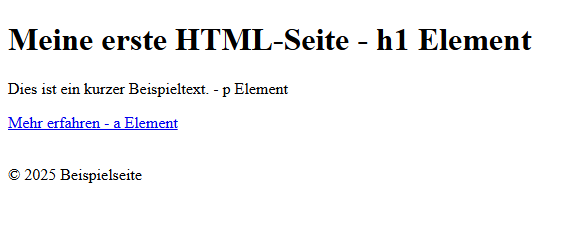
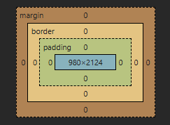

# Teilaufgabe Schüler Maksic

## Theorie

### Webtechnologien & Grundlagen
#### HTML 
##### Definition und Zweck von HTML
HTML (HyperText Markup Language) ist eine Auszeichnungssprache und bildet das Gerüst einer Website. Sie beschreibt die Struktur sowie die Inhalte einer Webseite mithilfe von sogenannten Elementen. Diese Elemente dienen als Bausteine und definieren beispielsweise Überschriften, Absätze, Links oder Bilder. [@webdev-learn-html]

Ein Tag bezeichnet dabei eine Auszeichnung in spitzen Klammern `< >`, mit der festgelegt wird, welche Bedeutung ein bestimmter Inhalt besitzt und wie dieser vom Webbrowser interpretiert wird. [@webdev-learn-html]

Zusätzlich können Tags sogenannte Attribute enthalten. Attribute liefern weiterführende Informationen zu einem Element und werden im öffnenden Tag definiert. Ein typisches Beispiel ist das `href`-Attribut beim `<a>`-Tag, welches die Zieladresse eines Hyperlinks festlegt, oder das `src`-Attribut beim ``-Tag, das die Quelle eines Bildes angibt. [@webdev-learn-html]
```html
<a href="https://www.example.com">Zur Beispielseite</a>

```


##### Strukturierende Elemente 
| Tag | Tag Name | Definition |
|----------|----------|----------|
| `<html>...</html>` | HTML | Wurzelelement eines HTML-Dokuments, es umschließt den gesamten Seiteninhalt und wird dadurch vom Browser als HTML interpretiert. |
| `<head>...</head>` | Head | Enthält Metadaten wie Titel, Zeichensatz oder Verweise auf CSS-Dateien. |
| `<body>...</body>` | Body | Beinhaltet den sichtbaren Inhalt der Webseite. |
| `<header>...</header>` | Header | Kopfbereich einer Webseite oder eines Abschnitts. |
| `<footer>...</footer>` | Footer | Fußbereich einer Webseite oder eines Abschnitts. |
| `<div>...</div>` | Division | Allgemeiner Container zur Strukturierung und Gruppierung von Inhalten. |

##### Inhaltliche / textbezogene Elemente
| Tag | Tag Name | Definition |
|----------|----------|----------|
| `<h1>...</h1>` | Heading | Überschrift (Stufe 1–6). Je größer die Zahl, desto kleiner die Überschrift. |
| `<p>...</p>` | Paragraph | Absatz zur Darstellung von Fließtext. |
| `<a href="...">...</a>` | Anchor | Erstellt einen Hyperlink zu einer internen oder externen Ressource. |
| `` | Image | Bindet ein Bild in die Webseite ein; `alt` dient als Alternativtext. |

##### Void Elemente 
Void Elemente (auch leere Elemente genannt) sind Elemente, die keinen Inhalt besitzen und daher kein schließendes Gegenstück benötigen. Sie bestehen ausschließlich aus einem einzelnen Tag und werden verwendet, um eigenständige Elemente einzubinden. [@webdev-learn-html]

Beispiele:
| Tag | Tag Name | Beschreibung |
|----------|----------|-------------|
| `` | Image | Bindet ein Bild in eine Webseite ein; der sichtbare Inhalt stammt aus der verknüpften Bilddatei. |
| `<br>` | Line Break | Erzwingt einen Zeilenumbruch innerhalb eines Textflusses. |
| `<hr>` | Horizontal Rule | Fügt eine horizontale Trennlinie zur inhaltlichen Gliederung ein. |
| `<input>` | Input | Stellt ein Formularelement (z. B. Textfeld, Checkbox) als UI-Widget bereit. |

##### Ersetzte Elemente
Ersetzte Elemente sind HTML-Elemente, deren dargestellter Inhalt nicht aus dem HTML-Text selbst stammt, sondern durch ein externes Objekt ersetzt wird. Viele ersetzte Elemente sind Void-Elemente, aber nicht alle ersetzten Elemente sind Void-Elemente. [@webdev-learn-html]

Beispiele für Ersetzte Elemente sind: ``, `<video>`, `<input>`


```HTML
<!DOCTYPE html>
<html lang="de">
<head>
    <meta charset="UTF-8">
    <title>Beispielseite</title>
</head>
<body>

    <header>
        <h1>Meine erste HTML-Seite - h1 Element</h1>
    </header>
        <p>Dies ist ein kurzer Beispieltext. - p Element</p>
        <a href="https://www.example.com">Mehr erfahren - a Element</a>
        <br><br>
    <footer>
        <p>&copy 2025 Beispielseite</p>
    </footer>

</body>
</html>
```
Dieses Beispiel zeigt den grundlegenden Aufbau einer HTML-Seite mit Struktur (`html`, ``head``, ``body``), inhaltlichen Elementen (``h1``, ``p``, ``a``) sowie einem Void- und ersetzten Element (``br``)

{width=80%}
#### CSS

##### Definition und Zweck von CSS
CSS (Cascading Style Sheets) ist eine Stylesheet-Sprache, die zur visuellen Gestaltung und Layoutdefinition von Webseiten eingesetzt wird. Sie ergänzt HTML, indem sie das Erscheinungsbild von Elementen steuert, beispielsweise Farben, Schriftarten, Abstände, Positionierungen und Anordnungen von Inhalten. 
[@webdev-learn-css]

Ein zentrales Ziel von CSS ist die Trennung von Inhalt und Design. Dadurch können Layout und Gestaltung unabhängig vom eigentlichen Seiteninhalt definiert und zentral angepasst werden. CSS bietet hierfür zahlreiche Konzepte wie das Box-Modell, Selektoren, die Kaskade und Spezifität sowie moderne Layoutmechanismen wie Flexbox und Grid, mit denen responsive und benutzerfreundliche Oberflächen realisiert werden können. [@webdev-learn-css]

##### Box-Modell
Das CSS-Box-Modell beschreibt, wie Elemente im Browser dargestellt und im Layout berechnet werden. Jedes HTML-Element wird dabei als rechteckige Box betrachtet, die aus mehreren Bereichen besteht. Diese Bereiche setzen sich aus dem eigentlichen Inhalt (Content), dem Innenabstand (Padding), dem Rahmen (Border) sowie dem Außenabstand (Margin) zusammen. [@webdev-learn-css]

Der Content-Bereich enthält den eigentlichen Inhalt eines Elements, beispielsweise Text oder Bilder. Das Padding definiert den Abstand zwischen Inhalt und Rahmen, während die Border den Rand des Elements bildet. Das Margin legt schließlich den Abstand eines Elements zu benachbarten Elementen fest. Die Gesamtgröße eines Elements ergibt sich aus der Summe dieser Bereiche. [@webdev-learn-css]

Standardmäßig bezieht sich die in CSS angegebene Breite und Höhe nur auf den Content-Bereich. Mithilfe der Eigenschaft `box-sizing` kann dieses Verhalten angepasst werden, sodass Padding und Border in die Berechnung der Elementgröße einbezogen werden. Dies erleichtert insbesondere die Erstellung konsistenter und responsiver Layouts. [@webdev-learn-css]

{width=60%}

##### CSS-Selektoren
CSS-Selektoren dienen dazu, bestimmte HTML-Elemente gezielt auszuwählen, um auf diese Gestaltungsregeln anzuwenden. Mithilfe von Selektoren kann festgelegt werden, welche Elemente formatiert werden sollen, beispielsweise abhängig von ihrem Typ, ihrer Klasse, ihrer ID, ihren Attributen oder ihrer Position im Dokument. Dadurch ermöglicht CSS eine präzise und flexible Steuerung des Erscheinungsbildes von Webseiten. [@webdev-learn-css]

Eine CSS-Regel besteht grundsätzlich aus einem oder mehreren Selektoren sowie einer oder mehreren Deklarationen. Eine Deklaration setzt sich aus einer Eigenschaft und einem zugehörigen Wert zusammen und definiert, wie das ausgewählte Element dargestellt wird. [@webdev-learn-css]

Darüber hinaus bietet CSS Pseudoklassen und Pseudoelemente. Pseudoklassen reagieren auf Zustände oder Interaktionen eines Elements, etwa wenn sich der Mauszeiger darüber befindet oder ein Element ausgewählt ist. Pseudoelemente hingegen ermöglichen es, gezielt Teile eines Elements zu gestalten oder zusätzliche Inhalte darzustellen, ohne das HTML-Dokument zu verändern. [@webdev-learn-css]

Für komplexere Auswahlmöglichkeiten stellt CSS sogenannte Kombinatoren bereit. Diese erlauben es, Elemente basierend auf ihrer Beziehung zueinander auszuwählen, beispielsweise als Nachfahren, direkte Kinder oder Geschwisterelemente. Durch die Kombination verschiedener Selektoren lassen sich sehr spezifische und leistungsfähige Stilregeln definieren. [@webdev-learn-css]

Beispiele für CSS-Selektoren:
| Selektor | Selektorart | Beschreibung |
|----------|-------------|-------------|
| `*` | Universalselektor | Wählt alle Elemente einer Webseite aus. |
| `.container` | Klassenselektor | Wählt alle Elemente mit einer bestimmten Klasse aus. |
| `#header` | ID-Selektor | Wählt ein Element mit einer eindeutigen ID aus. |
| `a:hover` | Pseudoklasse | Wählt Elemente abhängig von einem Interaktionszustand aus. |
| `p::first-line` | Pseudoelement | Wählt einen bestimmten Teil eines Elements aus. |
| `div p` | Nachfahren-Kombinator | Wählt untergeordnete Elemente innerhalb eines anderen Elements aus. |
| `ul > li` | Kind-Kombinator | Wählt nur direkte Kindelemente aus. |
| `h1, h2, h3` | Gruppierung | Fasst mehrere Selektoren in einer Regel zusammen. |

##### CSS-Eigenschaften
CSS-Eigenschaften dienen dazu, das Erscheinungsbild von HTML-Elementen zu steuern. Sie definieren konkrete Darstellungsmerkmale wie Farben, Schriftarten, Abstände oder Ausrichtungen und werden innerhalb von CSS-Deklarationen verwendet. Jede Eigenschaft wird dabei mit einem zugehörigen Wert kombiniert, um eine bestimmte visuelle Wirkung zu erzielen. [@webdev-learn-css]

Zu den grundlegenden CSS-Eigenschaften zählen unter anderem Eigenschaften zur Textgestaltung und Farbdefinition. Mit ihnen kann festgelegt werden, wie Inhalte dargestellt und wahrgenommen werden, ohne die zugrunde liegende HTML-Struktur zu verändern. Dadurch ermöglicht CSS eine klare Trennung zwischen Inhalt und Präsentation. [@webdev-learn-css]

Die CSS-Regeln werden üblicherweise in einer separaten Datei (z. B. ``style.css``) gespeichert. 

```CSS
/* Grundlegende Seiteneinstellungen */
body {
    font-family: Arial, sans-serif;
    margin: 0;
    padding: 0;
    background-color: #f4f4f4;
    color: #333;
}

/* Kopfbereich */
header {
    background-color: #2c3e50;
    color: white;
    padding: 20px;
    text-align: center;
}

/* Textinhalt */
p {
    font-size: 1rem;
    line-height: 1.5;
    margin: 20px;
}

/* Linkgestaltung */
a {
    color: #0066cc;
    text-decoration: none;
    margin-left: 20px;
}

a:hover {
    text-decoration: underline;
}

/* Fußbereich */
footer {
    background-color: #ddd;
    text-align: center;
    padding: 10px;
    font-size: 0.9rem;
}
```
Das gezeigte CSS-Stylesheet zeigt die grundlegende Verwendung von CSS zur Gestaltung einer einfachen Webseite. Es definiert unter anderem Schriftarten, Farben, Abstände sowie die Ausrichtung von Texten und verdeutlicht damit die Trennung von Struktur (HTML) und Darstellung (CSS). 


Um ein externes CSS-Stylesheet in eine HTML-Seite einzubinden, wird im `<head>`-Bereich des HTML-Dokuments ein sogenanntes `link`-Element verwendet. 

```HTML
<link rel="stylesheet" href="style.css">
```

{width=80%}

#### JavaScript

##### Definition und Zweck von JavaScript
JavaScript ist eine skriptbasierte Programmiersprache, die zur Umsetzung von Logik, Interaktivität und dynamischem Verhalten auf Webseiten eingesetzt wird. [@webdev-learn-js]

Im Gegensatz zu kompilierten Programmiersprachen wird JavaScript direkt im Webbrowser interpretiert. Der JavaScript-Code wird zusammen mit HTML und CSS an den Browser übertragen und dort Schritt für Schritt ausgeführt. Dabei analysiert der Interpreter den Quelltext, verarbeitet Anweisungen und Ausdrücke und führt die definierten Aktionen unmittelbar aus. [@webdev-learn-js]

JavaScript dient vor allem dazu, Webseiten interaktiv zu gestalten. Mithilfe der Sprache können Benutzeraktionen verarbeitet, Inhalte dynamisch verändert und Abläufe zur Laufzeit gesteuert werden. [@webdev-learn-js]

##### Variablen und Datentypen
Variablen sind grundlegende Sprachelemente in JavaScript und dienen dazu, Werte unter einem aussagekräftigen Namen zu speichern. Sie ermöglichen es, Daten während der Programmausführung zwischenzuspeichern und weiterzuverarbeiten. Eine Variable besteht dabei aus einem Bezeichner (Name) und einem zugewiesenen Wert. [@webdev-learn-js]

Zur Deklaration von Variablen stellt JavaScript die Schlüsselwörter `let`, `const` und `var` zur Verfügung:

| Schlüsselwort | Verwendungszweck | Gültigkeitsbereich (Scope) |
|--------------|------------------|----------------------------|
| `let` | Deklariert eine veränderbare Variable. | Block-Scope |
| `const` | Deklariert eine Konstante, deren Wert nicht neu zugewiesen werden kann. | Block-Scope |
| `var` | Ältere Form der Variablendeklaration. | Funktions- bzw. Global-Scope |

Der Gültigkeitsbereich (Scope) beschreibt den Bereich eines Programms, in dem eine Variable verfügbar ist und verwendet werden kann. Variablen mit Block-Scope sind nur innerhalb des umschließenden Codeblocks zugänglich, während Variablen mit Funktions- oder globalem Scope innerhalb einer gesamten Funktion bzw. im gesamten Skript verfügbar sind. [@webdev-learn-js]

JavaScript ist eine dynamisch typisierte Sprache. Das bedeutet, dass Variablen keinen festen Datentyp besitzen, sondern ihr Typ zur Laufzeit aus dem zugewiesenen Wert abgeleitet wird. Dadurch können Variablen während der Ausführung unterschiedliche Datentypen annehmen. [@webdev-learn-js]

| Datentyp | Bezeichnung | Beschreibung |
|---------|-------------|--------------|
| `string` | Zeichenkette | Speichert Textwerte, z. B. Wörter oder Sätze. |
| `number` | Zahl | Speichert Ganzzahlen und Gleitkommazahlen. |
| `boolean` | Wahrheitswert | Kann die Werte `true` oder `false` annehmen. |
| `undefined` | Nicht definiert | Variable wurde deklariert, aber noch kein Wert zugewiesen. |
| `null` | Leerer Wert | Bewusste Zuweisung eines leeren bzw. nicht vorhandenen Wertes. |
| `object` | Objekt | Komplexer Datentyp zur Speicherung strukturierter Daten. |
| `array` | Array | Spezielle Objektform zur Speicherung mehrerer Werte in einer Liste. |
| `function` | Funktion | Wiederverwendbarer Codeblock, der ausgeführt werden kann. |

Variablen im globalen Gültigkeitsbereich sollten möglichst vermieden werden, da sie zu unerwarteten Seiteneffekten und Namenskollisionen führen können. [@webdev-learn-js]

JavaScript verarbeitet Variablendeklarationen vor der eigentlichen Ausführung des Codes. Dieses Verhalten wird als Hoisting bezeichnet. Moderne Schlüsselwörter wie `let` und `const` verhindern dabei unbeabsichtigte Zugriffe auf Variablen vor deren Deklaration und tragen so zu einer besseren Codequalität und Fehlersicherheit bei. [@webdev-learn-js]

##### Funktionen
Funktionen sind zentrale Bausteine in JavaScript und dienen dazu, wiederverwendbaren Code zu kapseln. Sie ermöglichen es, Abläufe zu strukturieren, Logik mehrfach auszuführen und Programme übersichtlicher sowie wartbarer zu gestalten. Funktionen können Parameter entgegennehmen und optional einen Rückgabewert liefern. [@webdev-learn-js]

In JavaScript können Funktionen auf unterschiedliche Arten definiert werden. Eine häufig verwendete Form sind Funktionsausdrücke, bei denen eine Funktion als Wert behandelt und einer Variablen zugewiesen wird. Dabei können sowohl anonyme als auch benannte Funktionen verwendet werden. Funktionsausdrücke werden erst zur Laufzeit ausgewertet und stehen somit erst nach ihrer Definition zur Verfügung. [@webdev-learn-js]

Eine moderne Variante von Funktionsausdrücken sind sogenannte Pfeilfunktionen (Arrow Functions). Sie bieten eine kompaktere Syntax und werden häufig für kurze Funktionen verwendet. Pfeilfunktionen besitzen keinen eigenen `this`-Kontext, sondern übernehmen diesen aus der umgebenden Umgebung, was ihr Verhalten von klassischen Funktionen unterscheidet. [@webdev-learn-js]

Zusätzlich existieren sofort aufgerufene Funktionsausdrücke (Immediately Invoked Function Expressions, IIFE). Diese Funktionen werden direkt nach ihrer Definition ausgeführt und wurden insbesondere in älteren Codebasen genutzt, um den globalen Gültigkeitsbereich zu vermeiden und Variablen zu kapseln. [@webdev-learn-js]

```javascript
    // Funktionsausdruck
    const showMessage = function () {
        console.log("Button wurde geklickt.");
    };

    // Pfeilfunktion als Event-Handler
    document.getElementById("myButton").addEventListener("click", () => {
        showMessage();
    });
```
Dieses Codebeispiel zeigt die Verwendung einer Funktion in JavaScript in Kombination mit einem Ereignis. Beim Klick auf den Button wird eine Funktion ausgeführt, die eine Meldung in der Konsole ausgibt. Dadurch wird veranschaulicht, wie JavaScript zur Umsetzung von Interaktivität auf Webseiten eingesetzt werden kann.

##### Ereignisse (Events)
Events beschreiben Aktionen oder Zustände, die während der Nutzung einer Webseite auftreten, beispielsweise Benutzerinteraktionen. JavaScript ermöglicht es, auf solche Ereignisse zu reagieren, indem Funktionen ausgeführt werden, sobald ein bestimmtes Ereignis eintritt. Dadurch können Webseiten dynamisch auf das Verhalten von Nutzerinnen und Nutzern reagieren. [@webdev-learn-js]

In den zuvor dargestellten Beispielen wurde JavaScript verwendet, um auf ein Benutzerereignis zu reagieren. Dabei wird eine Funktion an ein bestimmtes Element gebunden und bei Auslösung des Ereignisses ausgeführt. Diese Vorgehensweise bildet die Grundlage für Interaktivität auf Webseiten und wird häufig in Kombination mit Funktionen eingesetzt. [@webdev-learn-js]

#### TypeScript 

##### Definition und Zweck von TypeScript
TypeScript ist eine Programmiersprache, die JavaScript um ein statisches Typsystem erweitert. Ziel dieser Erweiterung ist es, Datentypen bereits zur Entwicklungszeit festzulegen und dadurch potenzielle Fehler frühzeitig zu erkennen. Während JavaScript viele Probleme erst zur Laufzeit sichtbar macht, ermöglicht TypeScript durch explizite Typinformationen eine statische Analyse des Codes. Auf diese Weise kann überprüft werden, ob bestimmte Operationen sinnvoll sind, etwa ob Eigenschaften existieren oder ob ein Wert aufrufbar ist. [@typescriptlang-docs]

Ein statischer Type-Checker wie TypeScript analysiert den Quellcode anhand der vorhandenen Typinformationen und prüft unter anderem die Korrektheit von Funktionsaufrufen sowie die Übereinstimmung von Argumenten und Parametern. Dadurch lassen sich typische Programmierfehler bereits während der Entwicklung identifizieren, bevor der Code ausgeführt wird. [@typescriptlang-docs]

##### Der Compiler `tsc` und Transpilierung
TypeScript-Code wird mithilfe des Compilers ``tsc`` verarbeitet. Dabei werden Dateien mit der Endung ``.ts`` in äquivalenten JavaScript-Code übersetzt. Treten während der Typprüfung keine Fehler auf, erzeugt der Compiler die entsprechende JavaScript-Ausgabe. Werden Typfehler festgestellt, gibt tsc diese aus. Abhängig von der Konfiguration kann dennoch JavaScript-Code generiert werden. [@typescriptlang-docs]

##### Typannotationen, Typinferenz und „Erased Types“
TypeScript ermöglicht das Angeben von Typen durch Typannotationen, beispielsweise bei Variablen oder Funktionsparametern, um die erwarteten Datentypen eindeutig festzulegen. In vielen Fällen ist eine solche Annotation jedoch nicht erforderlich, da TypeScript die Typen automatisch aus dem Kontext ableiten kann. [@typescriptlang-docs]

Wichtig ist, dass Typannotationen ausschließlich für die Entwicklung und Prüfung relevant sind: Beim Übersetzen in JavaScript werden diese Typinformationen entfernt („erased types“). Typen verändern somit nicht das Laufzeitverhalten eines Programms. [@typescriptlang-docs]

##### Strictness und Type-Checking-Optionen
TypeScript bietet Konfigurationsoptionen, um die Strenge der Typprüfung zu steuern. Dadurch kann ein Projekt von einer eher „lockeren“ Prüfung schrittweise zu einer strengeren, sichereren Prüfung übergehen. Zu den zentralen Optionen zählen unter anderem `noImplicitAny` (um implizite `any`-Typen zu vermeiden) sowie `strictNullChecks`, wodurch `null` und `undefined` expliziter behandelt werden müssen. [@typescriptlang-docs]

```ts
// TypeScript-Beispiel mit Typannotationen

function greet(name: string, date: Date): void {
    console.log(`Hallo ${name}, heute ist ${date.toDateString()}`);
}

// Korrekte Verwendung
greet("Nikola", new Date());

// Fehlerhafte Verwendung (würde von TypeScript erkannt werden)
// greet(123, "heute");

```
In diesem Beispiel werden Typannotationen für die Funktionsparameter verwendet. TypeScript überprüft bereits zur Entwicklungszeit, ob die Funktion mit den erwarteten Datentypen aufgerufen wird. Abweichende Argumente führen zu einem Compilerfehler, noch bevor JavaScript-Code erzeugt oder ausgeführt wird. Die Typinformationen werden beim Kompilieren entfernt, sodass das Laufzeitverhalten des Programms unverändert bleibt.

### React & Next.js
#### Next.js
Next.js ist ein auf React basierendes Web-Framework zur Entwicklung moderner Webanwendungen. Es erweitert React um zentrale Funktionen wie serverseitiges Rendern (Server-Side Rendering, SSR), statische Seitengenerierung (Static Site Generation, SSG), dateibasiertes Routing, API-Routen sowie integrierte Mechanismen zur Optimierung von Performance. [@nextjs-docs]

##### Server-Side Rendering
In Next.js werden Layouts und Seiten standardmäßig serverseitig gerendert: Der benötigte Inhalt wird dabei auf dem Server erzeugt und anschließend an den Browser übertragen. [@nextjs-docs]

Dabei gibt es 2 Varianten: Static Rendering (auch Prerendering) erstellt die Seiten bereits beim Build oder bei einer späteren Aktualisierung und speichert das Ergebnis im Cache. Dynamic Rendering generiert die Seite erst bei einer konkreten Anfrage zur Laufzeit. [@nextjs-docs]


##### Routing 
Routing ist in Next.js die Navigation zwischen verschiedenen Seiten (Routen) einer Webanwendung. Routen werden standardmäßig serverseitig gerendert, wobei Layouts und Pages als React Server Components umgesetzt sind. Bei einer Navigation wird der sogenannte Server Component Payload auf dem Server erzeugt und anschließend an den Client übertragen. [@nextjs-docs]

#### React
React ist eine von Meta entwickelte JavaScript-Bibliothek zur Erstellung von Benutzeroberflächen. Sie basiert auf einem komponentenorientierten Ansatz, bei dem die Oberfläche in wiederverwendbare, unabhängige Bausteine (Components) zerlegt wird.[@reactdev-learn]

##### Komponenten-Konzept
React basiert auf dem Konzept von Komponenten, die als wiederverwendbare Bausteine zur Erstellung von Benutzeroberflächen dienen. Eine Komponente beschreibt, wie ein Teil der Benutzeroberfläche aussehen und sich verhalten soll, abhängig von Eingabedaten und internem Zustand. [@reactdev-learn]

In modernen React-Anwendungen werden Komponenten als Function Components umgesetzt. Dabei handelt es sich um normale JavaScript-Funktionen, die ein React-Element in Form von JSX zurückgeben. JSX ist eine Syntaxerweiterung für JavaScript, mit der UI-Strukturen wie HTML direkt im Code beschrieben werden können. React interpretiert JSX als JavaScript-Funktionsaufrufe. [@reactdev-learn]

Function Components können Props (Eingabewerte) entgegennehmen und mithilfe von Hooks internen Zustand und Logik verwalten. Dadurch lassen sich Darstellung und Verhalten einer Benutzeroberfläche klar kapseln. [@reactdev-learn]

##### Component-Tree, Props & State  
In React ist die Benutzeroberfläche als Component-Tree aufgebaut. Das bedeutet, dass eine Anwendung aus einer Wurzel-Komponente besteht, die weitere untergeordnete Komponenten enthält. Diese hierarchische Struktur ähnelt einem Baum, bei dem Eltern-Komponenten ihre Kinder rendern und steuern. [@reactdev-learn]

Props (Properties) dienen dazu, Daten von einer übergeordneten Komponente an eine untergeordnete Komponente weiterzugeben. Sie sind read-only, das heißt, eine Komponente darf ihre Props nicht selbst verändern. Props ermöglichen die Wiederverwendbarkeit von Komponenten, da deren Verhalten und Darstellung über übergebene Werte gesteuert werden kann. [@reactdev-learn]

State beschreibt den internen, veränderbaren Zustand einer Komponente. Er wird verwendet, um dynamische Daten zu speichern, die sich während der Laufzeit ändern können. Ändert sich der State, rendert React die betroffene Komponente automatisch neu, sodass die Benutzeroberfläche stets den aktuellen Zustand widerspiegelt. [@reactdev-learn]

##### Rendering & Hooks (useState, useEffect, useContext)  
In React beschreibt Rendering den Prozess, bei dem React anhand des aktuellen Zustands (State) und der übergebenen Eigenschaften (Props) bestimmt, wie die Benutzeroberfläche aussehen soll. Immer wenn sich Props oder State ändern, wird die betroffene Komponente erneut gerendert. React aktualisiert dabei effizient nur jene Teile der Oberfläche, deren Darstellung sich tatsächlich geändert hat. [@reactdev-learn]

| Hook | Zweck | Kurzbeschreibung|
| -------- | ------- | ------ |
| `useState`   | Zustand | Ermöglicht das Speichern und Aktualisieren von lokalen Zustandswerten innerhalb einer Komponente. Eine Zustandsänderung löst ein erneutes Rendering aus. |
| `useEffect`  | Seiteneffekte  | Wird verwendet, um Code auszuführen, der nicht direkt zur Darstellung gehört, z. B. Daten laden, Timer starten oder auf Änderungen reagieren.|
| `useContext` | Kontextzugriff | Erlaubt den Zugriff auf globale Daten, ohne Props durch viele Komponenten weiterreichen zu müssen.|

Hooks sind spezielle Funktionen, mit denen Funktionskomponenten zusätzliche Fähigkeiten erhalten. Sie ermöglichen es, Zustand zu verwalten, auf Lebenszyklus-Ereignisse zu reagieren oder globale Daten bereitzustellen, ohne Klassenkomponenten verwenden zu müssen. [@reactdev-learn]

```tsx
import { useState } from "react";

function Counter() {
  const [count, setCount] = useState(0);

  return (
    <button onClick={() => setCount(count + 1)}>
      Klicks: {count}
    </button>
  );
}
```
In diesem Codebeispiel kann man erkennen dass ``useState`` den Wert ``count`` speichert und eine Funktion ``setCount`` bereit stellt um diesen zu erhöhen.


```tsx
import { useEffect } from "react";

function Logger() {
  useEffect(() => {
    console.log("Komponente wurde gerendert");
  });

  return <p>Öffne die Konsole</p>;
}
```
Dieses Codebeispiel zeit wie ``useEffect`` nach dem Rendern der Komponente ausgeführt wird und somit eine Nachricht in die Konsole schickt.

```tsx
import { createContext, useContext } from "react";

const ThemeContext = createContext("light");

function ThemeText() {
  const theme = useContext(ThemeContext);
  return <p>Aktuelles Theme: {theme}</p>;
}
```
Hier sieht man wie ``useContext`` den Zugriff auf globale Werte ohne Props weiterzugeben erlaubt.

### Styling mit Tailwind CSS

#### Utility-First-Konzept  
#### Responsive Design & Breakpoints  
#### Komponenten-Styling im Adminpanel  

### Frontend-Architektur

#### Projekt-/Ordnerstruktur (Next.js)  
#### Schichtenmodell im Frontend (Pages, Components, Services)  
#### Wiederverwendbare UI-Komponenten  

### State-Management

#### Begriff „State“ im React-Kontext  
#### Lokaler State mit Hooks  
#### Globaler State mit Context API  
#### Datenfluss und UI-Updates  

### Routing & Navigation in Next.js

#### File-based Routing (Pages / App Router)  
#### Geschützte Routen (Protected Routes)  
#### Navigationskonzept (Navbar, Seitenaufbau im Adminpanel)  

### Supabase-Integration im Web

#### Supabase Überblick (Auth, Database, Realtime)  
#### Authentifizierung im Web (supabase-js)  
#### Datenzugriff (CRUD im Adminpanel)  
#### Realtime-Updates (z. B. Fahrten in Echtzeit)  

### Authentifizierung & Sicherheit

#### Session-Handling im Browser  
#### Rollen & Berechtigungen (Admin, Fahrer, Kunde)  
#### Row Level Security (RLS) & Policies  
#### Datenschutz und Umgang mit personenbezogenen Daten  

### Deployment & Servermanagement

#### Entwicklungs- vs. Produktionsumgebung  
#### Deployment der Adminoberfläche (z. B. Vercel / eigener Server)  
#### Umgang mit Umgebungsvariablen (Environment Variables)  
#### Grundlegendes Monitoring & Logging  

## Praktische Arbeit
